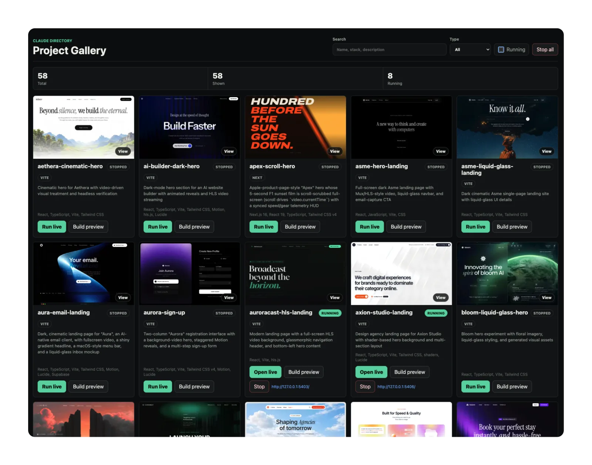

# claude-directory

A directory of experimental landing pages, hero sections, and interactive prototypes generated with Claude Fable 5.

Most project folders are self-contained and include the originating prompt as `prompt.md`, preserved alongside the generated code. Some prompts were inspired by or adapted from public prompt/design references, including [cnemri's gist](https://gist.github.com/cnemri/c917e11b3a6936823b509dcff53392aa) and [motionsites.ai](https://motionsites.ai/).

The code in this repository was generated on my side with Claude Fable 5. This whole repo is vibe coded, so use it with precautions: review the code, check dependencies, verify accessibility/responsiveness, and run the local project checks before using anything in production.

## Full overview

The fastest way to get a feel for everything in this repo is the **Project Gallery** — a Bun-only local dashboard that lists every project, plays its `demo.mp4`, and can launch a selected project live.



```bash
cd project-gallery
bun run dev
# then open http://127.0.0.1:4321
```

It loads the existing demos without installing anything; use **Run live** only when you want to install and start a specific project. See [`project-gallery/README.md`](./project-gallery/README.md) for thumbnail generation and full behavior.

## Contributing

Got a cool experiment? Toss it in. No issues, no templates, no ceremony — just shoot a PR.

Only two things are non-negotiable:

- **`prompt.md`** — the prompt you used to generate the project, dropped in the project folder.
- **`demo.mp4`** — a short screen recording of the thing actually working.

Beyond that, do whatever: any stack, any vibe, as long as your project lives in its own self-contained folder. Bonus points if you add a row to the table below, but no stress if you forget.

All PRs get reviewed and merged by Claude Opus, so don't be shy — if the prompt and demo are there, you're golden. 🤙

## Projects

| Project | Description | Stack |
|---------|-------------|-------|
| [aethera-cinematic-hero](./aethera-cinematic-hero/) | Cinematic hero for Aethera with video-driven visual treatment and headless verification | React, TypeScript, Vite, Tailwind CSS |
| [ai-builder-dark-hero](./ai-builder-dark-hero/) | Dark-mode hero section for an AI website builder with animated reveals and HLS video streaming | React, TypeScript, Vite, Tailwind CSS, Motion, hls.js, Lucide |
| [apex-scroll-hero](./apex-scroll-hero/) | Apple-product-page-style "Apex" hero whose 5-second F1 sunset film is scroll-scrubbed full-screen (scroll drives `video.currentTime`) with a synced speed/gear telemetry HUD | Next.js 16, React 19, TypeScript, Tailwind CSS v4 |
| [asme-hero-landing](./asme-hero-landing/) | Full-screen dark Asme landing page with Mux/HLS-style video, liquid-glass navbar, and email-capture CTA | React, JavaScript, Vite, CSS |
| [asme-liquid-glass-landing](./asme-liquid-glass-landing/) | Dark cinematic Asme single-page landing site with liquid-glass UI details | React, TypeScript, Vite, Tailwind CSS |
| [aura-email-landing](./aura-email-landing/) | Dark, cinematic landing page for "Aura", an AI-native email client, with fullscreen video, a shiny gradient headline, a macOS-style menu bar, and a liquid-glass inbox mockup | React, TypeScript, Vite, Tailwind CSS, Motion, Lucide, Supabase |
| [aurora-sign-up](./aurora-sign-up/) | Two-column "Aurora" registration interface with a background-video hero, staggered Motion reveals, and a multi-step sign-up form | React, TypeScript, Vite, Tailwind CSS v4, Motion, Lucide |
| [auroracast-hls-landing](./auroracast-hls-landing/) | Modern landing page with a full-screen HLS video background, glassmorphic navigation header, and bottom-left hero content | React, Vite, hls.js |
| [axion-studio-landing](./axion-studio-landing/) | Design agency landing page for Axion Studio with shader-based hero background and multi-section layout | React, TypeScript, Vite, Tailwind CSS, shaders, Lucide |
| [bloom-liquid-glass-hero](./bloom-liquid-glass-hero/) | Bloom hero experiment with floral imagery, liquid-glass styling, and generated visual assets | React, TypeScript, Vite, Tailwind CSS |
| [cinematic-stream-hero](./cinematic-stream-hero/) | LUMIERE full-viewport streaming hero with looping cinematic background video | React, TypeScript, Vite, Tailwind CSS |
| [codenest-hero](./codenest-hero/) | Dark coding-education hero for "CodeNest" with an HLS (Mux) video background, grid lines, central glow, and a liquid-glass floating card | React, TypeScript, Vite, Tailwind CSS, hls.js, Lucide, Vitest |
| [convix-pr-agency-hero](./convix-pr-agency-hero/) | Full-viewport hero for PR-agency SaaS "Convix Software" with a rounded-card layout, background video, and floating pill navbar | React, TypeScript, Vite, Tailwind CSS, Lucide |
| [core-features-gradient-cards](./core-features-gradient-cards/) | Static "Core Features" marketing section with three gradient feature cards | Single-file HTML/CSS |
| [datacore-video-hero](./datacore-video-hero/) | Responsive full-screen hero with a purple palette and an opaque fullscreen video background | React, TypeScript, Vite, Tailwind CSS, Lucide |
| [design-rocket-email](./design-rocket-email/) | Email-style marketing landing page for a "Design Rocket Certificates" AI leadership course | React, TypeScript, Vite, Tailwind CSS, Lucide |
| [designpro-video-hero](./designpro-video-hero/) | Full-screen hero for product-design education platform "DesignPro" with a looping video background and animated shiny gradient heading | React, TypeScript, Vite, Tailwind CSS, Framer Motion, Lucide |
| [digital-epoch-hero](./digital-epoch-hero/) | Rounded-card hero with looping video background, floating glass bottom navbar, and seamless CSS marquee logo scroller | React, TypeScript, Vite, Tailwind CSS v4, Motion, Lucide |
| [dot-daily-calm-landing](./dot-daily-calm-landing/) | "Dot." calm-living landing page with a glassmorphic pill navbar, typing messages, and a Nokia-style accent font | React 19, Vite, Tailwind CSS v4, Motion |
| [equilibrium-liquid-glass-hero](./equilibrium-liquid-glass-hero/) | Full-screen "Equilibrium" wellness hero with a liquid-glass UI over a looping background video | React, TypeScript, Vite, Tailwind CSS, Lucide |
| [fearless-vision-hero](./fearless-vision-hero/) | Full-screen hero with a background video, deep-purple accent, and Inter typography | React, JavaScript, Vite, Tailwind CSS, Framer Motion, Lucide |
| [forma-video-landing](./forma-video-landing/) | Full-screen video-background landing page with rounded card layout and contact form | React, TypeScript, Vite, Tailwind CSS, Lucide |
| [ironclad-password-hero](./ironclad-password-hero/) | Password-manager hero section for Ironclad with animated product-style presentation | React, TypeScript, Vite, Tailwind CSS, Framer Motion, Lucide |
| [jack-3d-portfolio](./jack-3d-portfolio/) | Dark-themed 3D creator portfolio landing page for Jack with gradient hero text | React, TypeScript, Vite, Tailwind CSS, Framer Motion |
| [linkflow-boomerang-hero](./linkflow-boomerang-hero/) | Linkflow hero concept with boomerang-style visual direction and CSS-only animations | React, TypeScript, Vite, Tailwind CSS, Lucide |
| [mainframe-hero-landing](./mainframe-hero-landing/) | Full-screen hero landing page for a creative agency called "Mainframe" with custom Helvetica Now display fonts | React, TypeScript, Vite, Tailwind CSS |
| [mainframe-scrub-hero](./mainframe-scrub-hero/) | Mainframe contact hero whose background film is scrubbed by cursor movement, with typewriter headline and multi-select service pills | React, TypeScript, Vite, Tailwind CSS, Motion, Lucide |
| [mentality-landing](./mentality-landing/) | MENTALITY landing page with video hero, glassmorphic navbar, and animated mobile drawer | React, TypeScript, Vite, Tailwind CSS, Motion |
| [michael-smith-portfolio](./michael-smith-portfolio/) | Dark single-page creator portfolio with GSAP / Framer Motion animations and HLS video | React, TypeScript, Vite, Tailwind CSS, GSAP, Framer Motion, hls.js, React Router |
| [microvisuals-boomerang-hero](./microvisuals-boomerang-hero/) | Fullscreen hero with GSAP boomerang-style animation and a custom display font | React, TypeScript, Vite, Tailwind CSS, GSAP, Lucide |
| [mindloop-mono-landing](./mindloop-mono-landing/) | Pure-black monochrome newsletter/content landing page for Mindloop | React, TypeScript, Vite, Tailwind CSS, shadcn-style UI |
| [neuralyn-dark-landing](./neuralyn-dark-landing/) | Dark landing page for analytics-dashboard SaaS "Neuralyn" with Framer Motion and shadcn/ui components | React, TypeScript, Vite, Tailwind CSS, Framer Motion, shadcn/ui, Lucide |
| [nexora-automation-hero](./nexora-automation-hero/) | Single-viewport SaaS automation hero ("Nexora") with Instrument Serif / Inter type and Framer Motion | React, TypeScript, Vite, Tailwind CSS, Framer Motion, shadcn/ui, Lucide |
| [nhm-paleontology-landing](./nhm-paleontology-landing/) | Paleontology-themed museum landing page with Inter / JetBrains Mono typography | React 19, Vite 6, Tailwind CSS v4, Motion, Lucide |
| [noctis-cinematic-hero](./noctis-cinematic-hero/) | NOCTIS full-screen dark cinematic hero with video background, nav, and timecode details | React, TypeScript, Vite, CSS |
| [orbis-nft-landing](./orbis-nft-landing/) | Dark, space-themed NFT landing page "Orbis.nft" with CloudFront video backgrounds and liquid-glass UI | React, TypeScript, Vite, Tailwind CSS, Lucide |
| [power-ai-hero](./power-ai-hero/) | Full-screen dark AI hero with a JS-controlled fade-loop background video, headline, CTA, and logo marquee | React, TypeScript, Vite, Tailwind CSS, Geist Sans, Lucide |
| [prisma landing](./prisma%20landing/) | Cinematic landing page for the creative studio PRISMA with dark, moody, warm cream palette | React, TypeScript, Vite, Tailwind CSS, Framer Motion |
| [rivr-defi-hero](./rivr-defi-hero/) | DeFi dashboard hero for RIVR with glassmorphism, badge/cards, and verification script | React, TypeScript, Vite, Tailwind CSS |
| [securify-data-hero](./securify-data-hero/) | Full-screen hero section for a fictional data-security SaaS called securify | React, TypeScript, Vite, Tailwind CSS |
| [sentinel-ai-hero](./sentinel-ai-hero/) | Full-screen dark hero for security company "Sentinel AI" with an embedded Spline 3D scene background | React, TypeScript, Vite, Tailwind CSS, shadcn/ui, Spline |
| [sidi-bou-said-3d-walk](./sidi-bou-said-3d-walk/) | Navigable, fully procedural 3D walk through Sidi Bou Said, Tunisia in a single HTML file | Three.js, single-file HTML/JS |
| [skyelite-jet-hero](./skyelite-jet-hero/) | Premium private jet hero section with full-viewport video background and luxury UI treatment | React, TypeScript, Vite, Tailwind CSS |
| [smart-prosthetics-hero](./smart-prosthetics-hero/) | Single-page hero with a fullscreen video background and pill-style navbar for a smart-prosthetics concept | React, TypeScript, Vite, Tailwind CSS, Lucide |
| [space-voyage-landing](./space-voyage-landing/) | Cinematic space-travel landing page with two video-backed full-height sections and liquid-glass UI | React via CDN, Tailwind CDN, Framer Motion, single-page HTML |
| [stellar-ai-landing-hero](./stellar-ai-landing-hero/) | "Stellar.ai" landing hero on a white background with staggered fade-in animations and Inter type | React, TypeScript, Vite, Tailwind CSS, Lucide |
| [taskly-liquid-glass-hero](./taskly-liquid-glass-hero/) | High-fidelity "liquid glass" hero for Taskly with a sticky glass navbar and dual-column layout on a white gradient-glow background | React, Vite |
| [toonhub-figurine-carousel](./toonhub-figurine-carousel/) | TOONHUB full-viewport character figurine carousel hero | React, TypeScript, Vite, Tailwind CSS, Lucide |
| [transform-data-hero](./transform-data-hero/) | Modern hero with a looping video background and a custom requestAnimationFrame fade system | React, TypeScript, Vite, Tailwind CSS |
| [usd-halo-landing](./usd-halo-landing/) | Premium fintech-style landing page for the stablecoin product "Halo / USD Halo" with a custom logo mark and TT Norms Pro type | React, TypeScript, Vite, Tailwind CSS, Lucide |
| [vanguard hero landing](./vanguard%20hero%20landing/) | Fullscreen hero landing page for the creative agency VANGUARD with looping background video | React, TypeScript, Vite, Tailwind CSS |
| [vaultshield-hero](./vaultshield-hero/) | VaultShield hero experiment with security-product positioning and CLI/headless verification | React, TypeScript, Vite, Tailwind CSS |
| [velorah-hero-landing](./velorah-hero-landing/) | Velorah hero landing page built with a modern Tailwind/shadcn-style component approach | React, TypeScript, Vite, Tailwind CSS, shadcn/ui |
| [viktor-oddy-landing](./viktor-oddy-landing/) | Single-page landing for creative design studio "Viktor Oddy" with custom PP Neue Montreal / PP Mondwest fonts and staggered animations | React, TypeScript, Vite, Tailwind CSS, Lucide |
| [wanderful-cinematic-hero](./wanderful-cinematic-hero/) | Full-viewport cinematic hero for travel brand "Wanderful" with GSAP animation and a custom display font | React, TypeScript, Vite, Tailwind CSS, GSAP, Lucide |
| [xero-encryption-hero](./xero-encryption-hero/) | Single-page encryption-product hero for "Xero" with an animated icon pipeline and a pink-magenta gradient arc on a black page, written in plain CSS | React, TypeScript, Vite, CSS |
