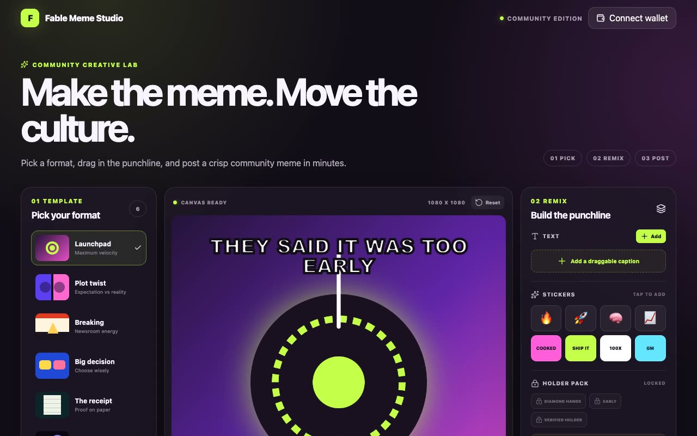

# Fable Meme Studio

[](./demo.mp4)

Fable Meme Studio is a browser-based community meme editor with original templates, image uploads, movable text and stickers, PNG export, X sharing, and optional Solana holder perks.

## Features

- Six original square meme templates
- PNG, JPG, and WebP template uploads
- Draggable, resizable, and rotatable text and stickers
- Editable caption text, size, and color
- Free community sticker pack
- 1080 x 1080 PNG export for everyone
- X intent flow that downloads the PNG before opening the composer
- Optional holder pack and 2160 x 2160 export for verified token holders
- Responsive controls for desktop and mobile

## Run locally

```bash
npm install
npm run dev
```

Build the production version with:

```bash
npm run build
```

## Configure the community

Copy `.env.example` to `.env` and set the values needed for your community:

```text
VITE_SOLANA_MINT_ADDRESS=your_pump_fun_token_mint
VITE_SOLANA_RPC_URL=your_solana_rpc_endpoint
VITE_HOLDER_MIN_BALANCE=1
VITE_TOKEN_TICKER=FABLE
VITE_COMMUNITY_URL=your_x_community_or_site_url
VITE_SHARE_TEXT=your_default_post_copy
```

The basic editor works when no mint is configured. Holder verification is enabled only when `VITE_SOLANA_MINT_ADDRESS` is present.

The wallet flow requests the connected public address and reads SPL token accounts through Solana JSON-RPC. It does not request a transaction, message signature, seed phrase, or private key. Client-side unlocks are appropriate for cosmetic perks such as stickers and higher-resolution exports. Enforce any valuable or server-backed benefit on a trusted server.

## Stack

React, TypeScript, Vite, Konva, react-konva, Lucide, and Solana JSON-RPC.
