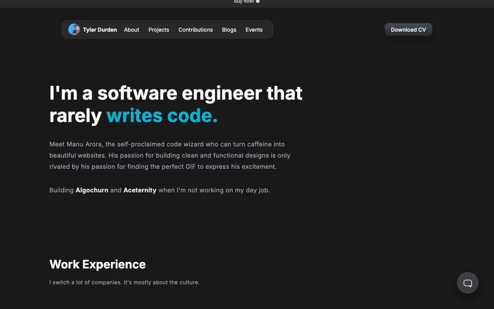

# DevPro Portfolio Template - Multi-page Developer Portfolio Template Clone (Vanilla HTML/CSS/JS, no build)

[](./demo.mp4)

A self-contained, pixel-faithful clone of the Aceternity DevPro Portfolio Template, a dark-themed, zinc-based multi-page developer portfolio originally built by Manu Arora. It reproduces all six pages, the shared navigation, responsive mobile menu, work experience tabs, projects, contributions, articles, events, timeline, and footer. The site uses plain HTML, CSS, and JavaScript with no build step.

## Run

No build step  -  serve the folder with any static server and open `index.html`:

```sh
python3 -m http.server 8080
```

Then visit `http://localhost:8080`. You can also open `index.html` directly in a browser.

The six pages are:

- `index.html`  -  Home: hero, work experience tab switcher, projects grid, contributions grid, blogs, footer
- `about.html`  -  Bio with side-by-side avatar layout and a detailed timeline (2015–2022)
- `projects.html`  -  Full project cards grid with hover tooltips
- `contributions.html`  -  Complete GitHub open-source contributions grid
- `blogs.html`  -  Blog posts list with dates
- `events.html`  -  Speaking events and talks list

The full build specification lives in `prompt.md`, and `demo.mp4` shows the template in motion.

## Credits

Faithful clone of an existing design, recreated for study/learning. All credit for the original design goes to its creators.

**Original:** Aceternity UI  -  https://ui.aceternity.com/template-preview/devpro-portfolio-template
