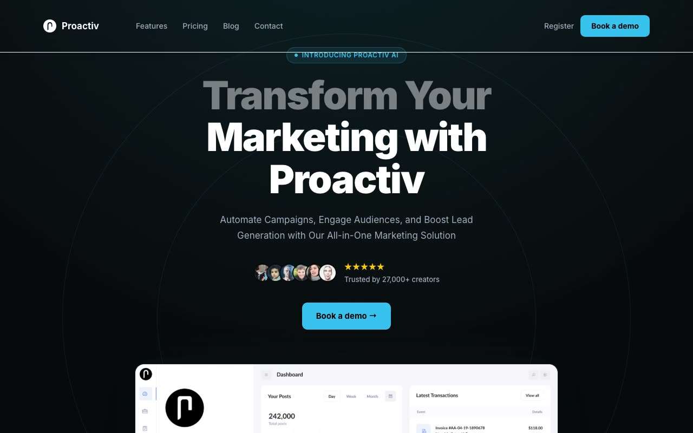

# Proactiv Marketing Template: Dark SaaS Landing Page Clone

[](./demo.mp4)

A pixel-faithful, self-contained recreation of the Proactiv Marketing Template by Aceternity UI. The six-page SaaS site uses plain HTML, CSS, and JavaScript with no build step. Its visual system combines a near-black background, cyan accents, Inter typography, responsive layouts, animated marquees, spotlight effects, interactive pricing, and scroll-triggered reveals.

## Pages

| File | Page |
|---|---|
| `index.html` | Home |
| `features.html` | Features |
| `pricing.html` | Pricing |
| `blog.html` | Blog |
| `contact.html` | Contact |
| `register.html` | Register |

## Key Features

- **Fixed floating navbar:** logo, page links, and auth CTAs that persist across all six pages
- **Hero with radial spotlight:** conic-gradient background effect, headline, avatar stack with star rating, and dashboard preview
- **Logos marquee:** infinite horizontal scroll of brand logos
- **Feature tabs panel:** five interactive content panels with switching images
- **Infinite testimonial marquee:** sixteen quote cards scrolling in opposing directions
- **Pricing toggle:** monthly and yearly pricing across four tiers
- **FAQ accordion:** ten collapsible questions on the home page
- **Blog cards:** featured image cards and a compact article list
- **Contact form:** responsive company details and message form
- **Register page:** provider buttons and email entry

## Run

Open `index.html` in your browser. No build step is required, and all assets are vendored locally.

For a local file server (avoids any browser same-origin restrictions on assets):

```sh
python3 -m http.server 8080
# then open http://localhost:8080
```

## Project Spec and Demo

`prompt.md` holds the full build specification. `demo.mp4` shows the finished result in motion.

## Credits

Faithful clone of an existing design, recreated for study/learning. All credit for the original design goes to its creators.

**Original:** [Aceternity UI Proactiv template](https://ui.aceternity.com/template-preview/proactiv-marketing-template)
