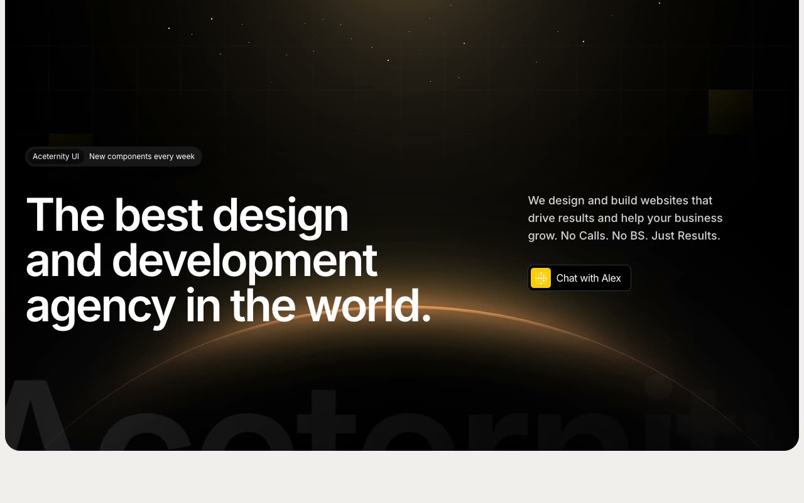

# Productized Agency Template: Aceternity Landing Page Clone

[](./demo.mp4)

A faithful, self-contained recreation of Aceternity's Productized Agency template in plain HTML, CSS, and JavaScript. The eleven-page site includes home, work, products, pricing, a blog index, and six article pages. It preserves the warm editorial palette, yellow accents, dark glowing hero, bento grids, comparison table, FAQ accordions, logo marquee, testimonials, and responsive interactions while keeping every asset local.

## Run

This is a plain static site with no build step or dependencies. Serve the folder over HTTP so the vendored fonts, images, and stylesheets load correctly:

```sh
python3 -m http.server 8000
```

Then open <http://localhost:8000/index.html>. Other pages: `work.html`, `products.html`, `pricing.html`, `blog.html`, and the six `blog-*.html` article pages.

## Structure

- `index.html`, `work.html`, `products.html`, `pricing.html`, and `blog.html`: core marketing pages
- `blog-*.html`: six complete blog article pages
- `css/`: self-hosted fonts, compiled utility styles, and interaction styles
- `js/app.js`: reveal, accordion, tab, marquee, carousel, and mobile menu behavior
- `assets/`: local fonts and images for offline use

`prompt.md` holds the full style and layout breakdown (palette, typography, per-page sections), and `demo.mp4` shows the site in motion.

## Credits

Faithful clone of an existing design, recreated for study/learning. All credit for the original design goes to its creators.

**Original:** [Aceternity Productized Agency template](https://ui.aceternity.com/template-preview/productized-agency-template)
