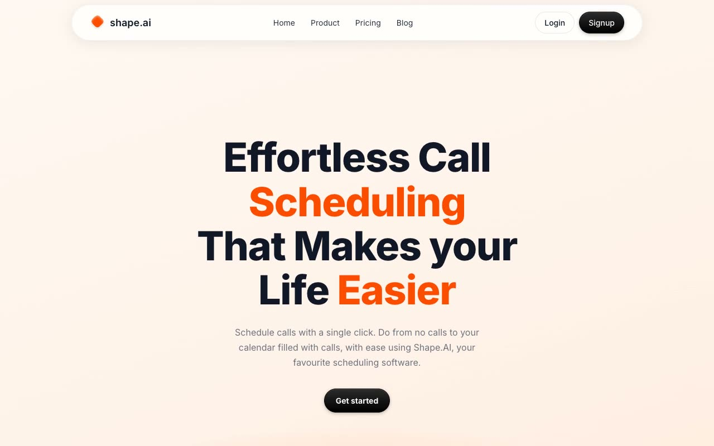

# Schedule Marketing Template

[](./demo.mp4)

A responsive recreation of Aceternity's Schedule Marketing Template for the fictional shape.ai scheduling brand. It includes a warm gradient hero, feature grids, integration cards, pricing, testimonials, FAQ interactions, blog content, authentication screens, and a faithful not-found state. The project uses plain HTML, CSS, and JavaScript with locally vendored images.

## Run

Serve the directory with any static file server:

```sh
python3 -m http.server 8765
```

Then open <http://localhost:8765>.

## Pages

| File | Description |
|---|---|
| `index.html` | Marketing home page |
| `blog.html` | Blog listing and search |
| `login.html` | Sign-in page |
| `signup.html` | Account creation page |
| `get-started.html` | Not-found state from the deployed reference |

`styles.css` contains the responsive visual system, while `main.js` provides search, FAQ, reveal, navigation, and accessibility behavior.

## Reference

[Aceternity Schedule Marketing template](https://ui.aceternity.com/template-preview/schedule-marketing-template)
