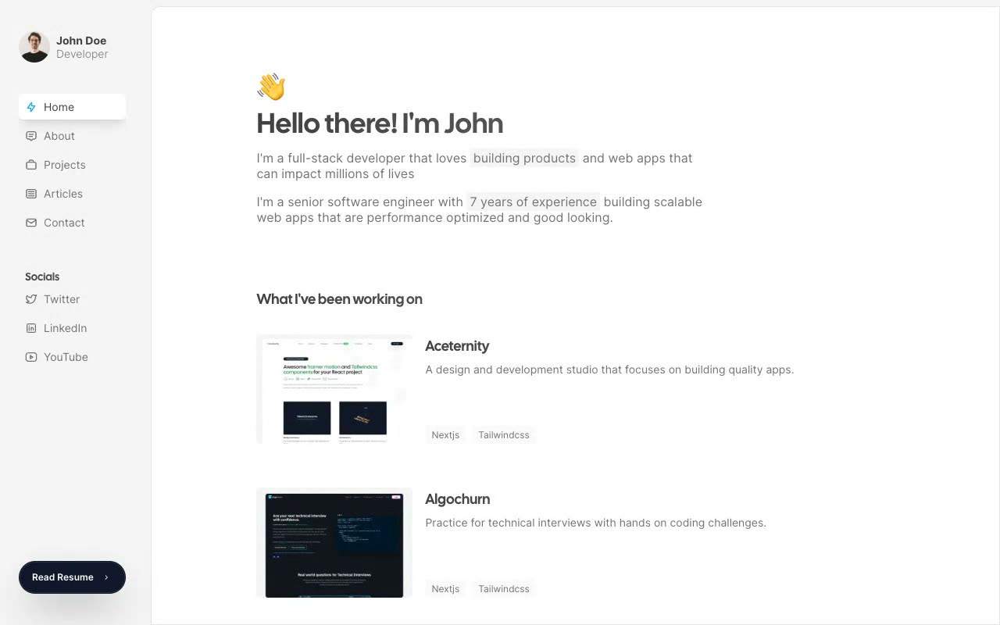

# Sidefolio Developer Portfolio

[](./demo.mp4)

A responsive, self-contained recreation of Aceternity's Sidefolio portfolio template. Its 14 routes cover home, about, project and article listings, four project case studies, four articles, contact, and resume. The interface uses a fixed profile sidebar, an independently scrolling rounded content panel, Cal Sans display typography, Inter body copy, animated cards, functional code-copy controls, and a mobile sidebar.

## Run

```sh
python3 -m http.server 8000
```

Then open <http://localhost:8000/index.html>.

## Structure

- Root HTML files provide the primary portfolio pages.
- `projects/` contains four project detail routes.
- `blog/` contains four complete article routes.
- `main.js` mounts shared navigation, footer, accessibility behavior, and interactions.
- `data.js` provides shared project and article content.
- `styles.css` defines the responsive visual system.

The complete design specification is in `prompt.md`, and `demo.mp4` shows the interface in motion.

## Reference

[Aceternity Sidefolio template](https://ui.aceternity.com/template-preview/sidefolio-portfolio-template)
