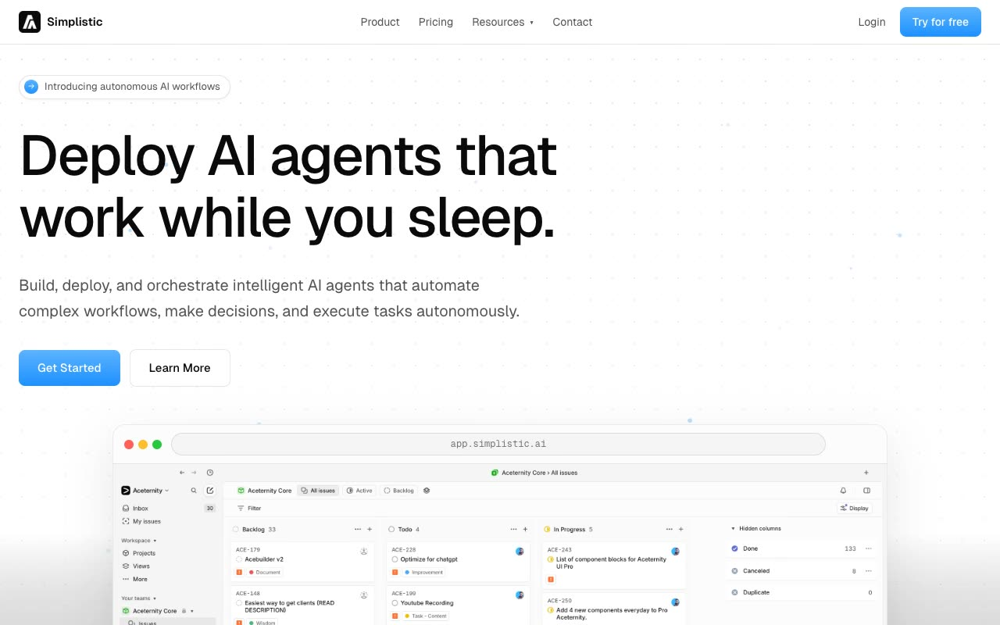

# Simplistic SaaS Template

[](./demo.mp4)

A responsive recreation of Aceternity's Simplistic SaaS template in plain HTML, CSS, and JavaScript. The three routes include a product landing page, detailed pricing, and sign-in. The interface includes an animated dot-grid hero, scroll reveals, responsive navigation, FAQ accordions, and a persistent light and dark theme system.

## Run

```sh
python3 -m http.server 8080
```

Then open <http://localhost:8080>.

## Pages

- `index.html`: product landing page
- `pricing.html`: pricing tiers and FAQ
- `login.html`: sign-in form

The complete design specification is in `prompt.md`. All fonts and images are vendored locally.

## Reference

[Aceternity Simplistic SaaS template](https://ui.aceternity.com/template-preview/simplistic-saas-template)
