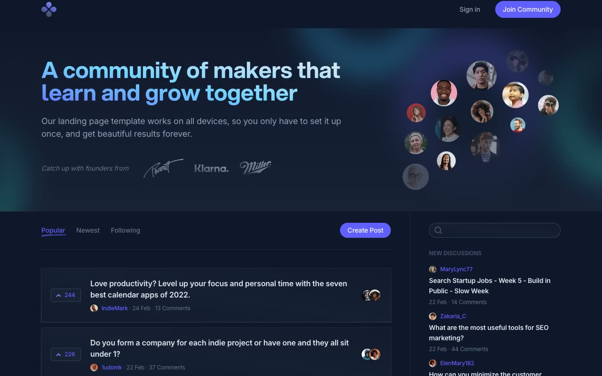

# Community: Dark-Themed Forum and Community Template Clone

[](./demo.mp4)

A pixel-faithful, self-contained clone of the **Community** template by [Cruip](https://cruip.com/demos/community/), a dark-mode marketing and app UI for an online community/forum product. It pairs a marketing hero with a Reddit/Indie-Hackers-style post feed, a single-post discussion view with threaded comments, authentication screens, company information, support, and legal content. All assets are vendored locally and the site runs fully offline with no build step.

## Pages

| Page | File |
|------|------|
| Home / Feed | `index.html` |
| Single Post / Discussion Thread | `post.html` |
| Sign In | `signin.html` |
| Join Community | `join.html` |
| About | `about.html` |
| Contact | `contact.html` |
| FAQs | `faq.html` |
| Privacy and Terms | `privacy-terms.html` |

## Run

No build step required. Open any of the HTML files directly in a browser, or serve the folder with a static file server:

```sh
cd templates/premium/cruip/community
python3 -m http.server 8080
```

## Tech Stack

- Plain HTML5 + CSS3 (utility-class styling, custom properties)
- [Alpine.js](https://alpinejs.dev/), vendored locally for dropdowns, feed tabs, and mobile nav transitions
- No build tools, no frameworks, no bundler

`prompt.md` in this folder holds the full build spec (palette, layout, and interaction notes), and `demo.mp4` shows the pages in motion.

## Credits

Faithful clone of an existing design, recreated for study/learning. All credit for the original design goes to its creators.

**Original:** Cruip, <https://cruip.com/demos/community/>

---

Browse more templates in the [premium collection](../../) or return to the [full fable gallery](../../../../README.md).
