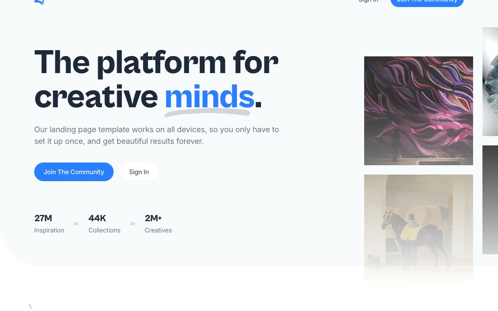

# Creative: Community and Mood-Board Template

[](./demo.mp4)

A pixel-faithful clone of the **Creative** template by Cruip, a light-themed marketing and editorial site for a creative-inspiration community. It includes the complete nine-page live route set and runs offline as plain HTML, CSS, and JavaScript with no build step.

## Pages

| Page | Description |
|------|-------------|
| `index.html` | Full marketing home page (hero, inspiration grid, trending collections, creatives, pricing, testimonial, FAQ, blog, CTA, footer) |
| `inspiration.html` | Inspiration detail page |
| `blog.html` | Editorial post listing |
| `blog-post.html` | Long-form editorial post |
| `contact.html` | Contact form and support details |
| `privacy.html` | Privacy policy |
| `signin.html` | "Welcome back, Creative!" sign-in form with social sign-in option |
| `signup.html` | "Join the community" sign-up form with terms checkbox and social signup option |
| `reset-password.html` | Password reset form with link back to sign in |

## Sections (Home)

1. **Header**: Logo plus "Sign in" and "Join the community" navigation
2. **Hero**: Headline, dual CTAs, stat row, and image collage
3. **Latest Inspiration**: Filter pills above a 3x3 image grid
4. **Trending Collections**: Dark band with a Swiper carousel
5. **Join Over 2M Creatives**: Creator cards and CTA
6. **Pricing**: Yearly and monthly toggle with two plan cards
7. **Testimonial**: Avatar, quote, handle, and story link
8. **FAQ**: Two-column question and answer list
9. **From Our Blog**: Swiper carousel of blog post cards
10. **Closing CTA**: Dark banner with angled edge
11. **Footer**: Newsletter, social, legal, and disclosure links

## Interactions

- **AOS scroll reveals**: fade-up and fade-right entrance animations on hero copy, section headings, and grid cards
- **Swiper carousels**: power the "Trending Collections" and "From Our Blog" horizontal scrollers
- **Alpine.js**: drives the mobile menu and interactive widgets
- **Hover states**: color and opacity transitions on buttons and links

## Stack

- Plain HTML + CSS (no build step)
- Self-hosted **Cabinet Grotesk** (WOFF/WOFF2, weights 500/700/800) for headlines; **Inter** (Google Fonts CDN, weights 400/500/600) for body text
- [AOS](https://michalsnik.github.io/aos/), vendored locally for scroll animation
- [Swiper](https://swiperjs.com/), vendored locally for carousels
- [Alpine.js](https://alpinejs.dev/), vendored locally for navigation and interactive widgets
- All CSS, JavaScript, fonts, and images are vendored locally

## Run

```bash
# From this folder, serve statically and open the pages
python3 -m http.server 8000
# then visit http://localhost:8000/index.html
```

## Verify

- Open `index.html` and scroll to verify AOS entrance effects
- Confirm the "Trending Collections" and "From Our Blog" carousels scroll via Swiper's prev/next arrows
- Resize to mobile width and confirm the Alpine.js hamburger menu opens/closes the nav
- Open `signin.html`, `signup.html`, and `reset-password.html` and confirm the forms render with the shared header/logo
- Confirm `demo.mp4` plays and `poster.jpg` exists

`prompt.md` in this folder holds the full build spec, and `demo.mp4` shows the template in motion.

## Credits

Faithful clone of an existing design, recreated for study/learning. All credit for the original design goes to its creators.

**Original:** Cruip, <https://cruip.com/demos/creative/>

---

Part of the [Cruip](../) premium templates in the [Templates](../../../) collection.
