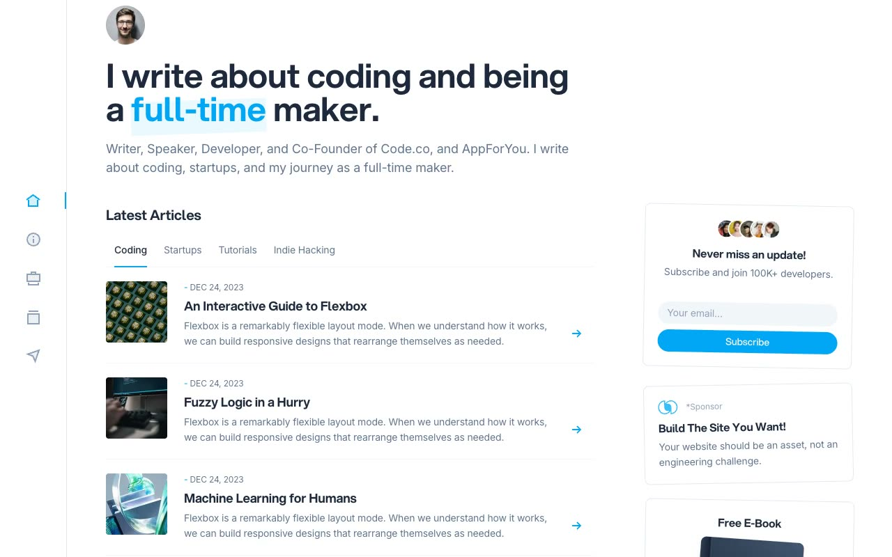

# DevSpace: Developer Blog and Personal-Brand Website Template Clone

[](./demo.mp4)

A faithful clone of the Cruip **DevSpace** developer and maker blog template, a clean six-page site built on a fixed left icon rail, centered content column, and right widget sidebar. It uses plain HTML, CSS, and JavaScript with no build step.

## Pages

1. **Home** (`index.html`): hero, Latest Articles categories, article rows, Popular Talks, Open-Source Projects, and sidebar widgets.
2. **About** (`about.html`): bio, career links, experience timeline, and connection section.
3. **Projects** (`projects.html`): side hustles and a two-column client project grid.
4. **Resume** (`resume.html`): education, work experience, awards, recommendations, skills, languages, and references.
5. **Subscribe** (`subscribe.html`): benefits checklist, email form, avatar stack, and testimonials.
6. **Post** (`post.html`): long-form article with subheadings, inline links, and syntax-tinted code blocks.

## Features

- Fixed left icon rail (Home, About, Projects, Resume, Subscribe + avatar)
- Sticky top utility row with search field, dark-mode light switch, and subscribe button
- Education / work / experience timelines
- Dark code blocks with PT Mono
- Light/dark theme via a `.dark` class on `<html>`
- Local images, Aspekta fonts, Alpine, icons, favicons, and `main.js`

## Run

This is a static site with no build step. Serve the project folder over HTTP and open `index.html`:

```sh
python3 -m http.server
```

Then visit `http://localhost:8000/index.html` in your browser. (Opening `index.html` directly from the filesystem also works, but a local server is recommended so fonts and assets load consistently.)

## Verify

There is no automated test script. Verify visually by opening all six pages, switching themes, focusing the search field, and checking responsive layouts.

`prompt.md` holds the full build spec (palette, fonts, type scale, per-page structure) and `demo.mp4` shows the template in motion.

## Credits

Faithful clone of an existing design, recreated for study/learning. All credit for the original design goes to its creators.

**Original:** Cruip, https://cruip.com/demos/devspace/
