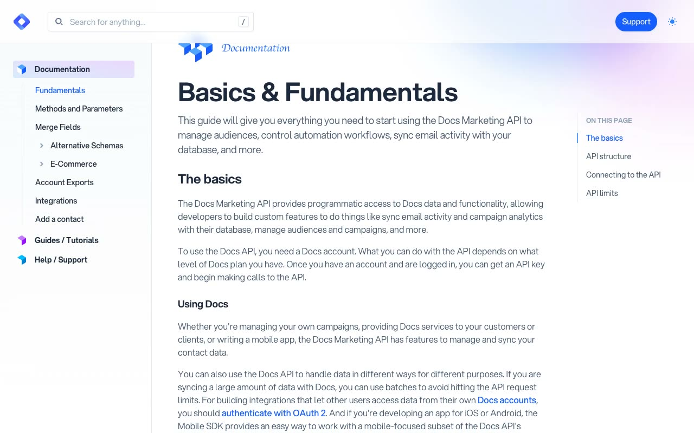

# Cruip Docs

A pixel-faithful reconstruction of the current Cruip Docs template, with a three-column documentation layout, nested navigation, search, article content, and responsive controls.

## Pages

- **index.html**: Basics and Fundamentals documentation
- **guides.html**: Marketing API Quick Start guide with image and video modal
- **help.html**: Help and Support with FAQ accordions

## Features

- Responsive fixed header, nested sidebar, article column, and scrollspy navigation
- Keyboard-accessible search overlay
- Persistent light and dark themes
- Responsive mobile sidebar
- Expandable navigation groups and FAQ rows
- Video modal with locally hosted media
- Local Aspekta, Nothing You Could Do, and PT Mono fonts
- Local images, favicons, scripts, and video assets

## Tech Stack

- Static HTML
- Compiled Tailwind CSS
- Alpine.js
- Vanilla JavaScript

## Original

https://cruip.com/demos/docs/
