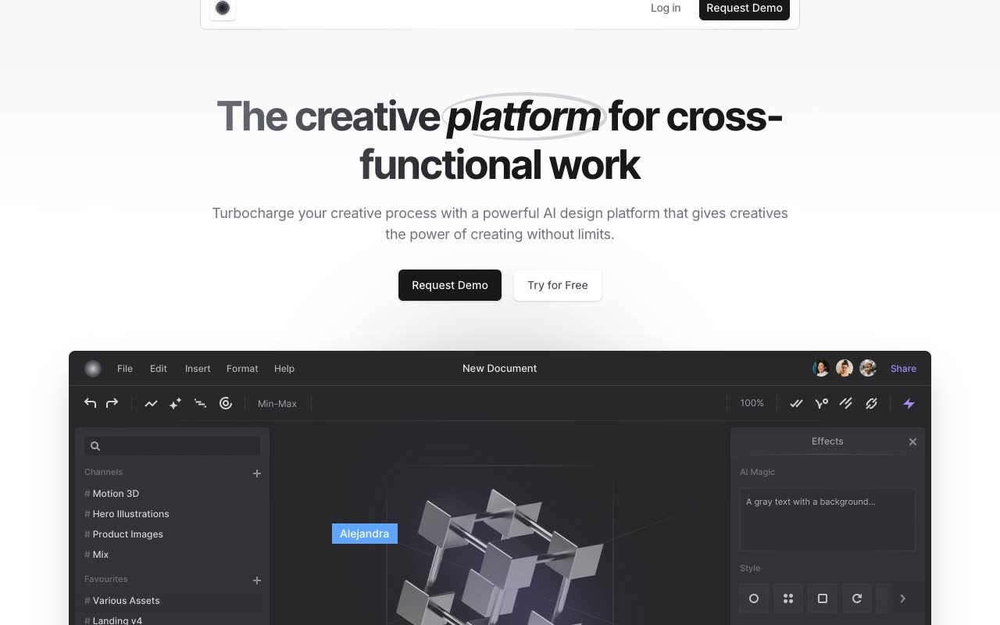

# Gray Creative Platform Template

A pixel-faithful reconstruction of the current Cruip Gray template, with interactive creative features, pricing, testimonials, and authentication pages.

## Pages

- `index.html`: Marketing home page
- `login.html`: Login form
- `request-demo.html`: Demo request form and footer content
- `reset-password.html`: Password reset form

## Features

- Animated hero counters
- Four-state creative feature tabs
- Three-state dark feature carousel
- Responsive bento feature layout
- Five-tier pricing slider
- Pricing tooltips and FAQ accordions
- Two infinite testimonial rows
- Responsive layouts for desktop, tablet, and mobile
- Local Inter and Inter Tight fonts
- Local images, favicons, and Alpine.js

## Tech Stack

- Static HTML
- Compiled Tailwind CSS
- Alpine.js
- Vanilla JavaScript

## Original

https://cruip.com/demos/gray/
