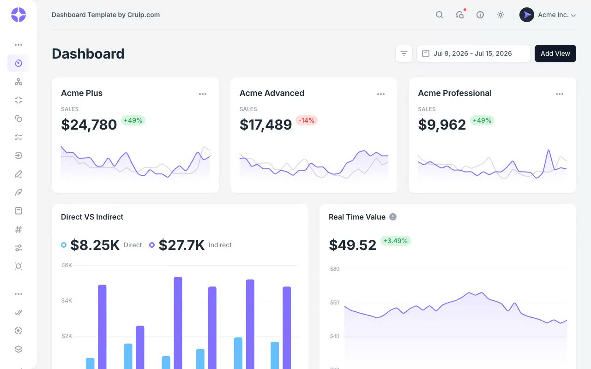

# Mosaic: Admin Dashboard UI Kit

[](./demo.mp4)

A faithful, self-contained reproduction of the current Cruip Mosaic admin dashboard template. The 75-page kit covers dashboards, e-commerce, community, finance, job boards, task management, messaging, calendars, campaigns, settings, authentication, onboarding, and UI component showcases. Tailwind CSS provides the styling, Alpine.js handles interactions, and Chart.js with Moment.js renders the data visualizations. The template includes light and dark themes, a collapsible sidebar, and a card-based layout system. No build step is required.

## Run

No build step. Serve the project root with any static file server and open `index.html`:

```sh
python3 -m http.server 8080
```

Then open `http://localhost:8080`.

## Pages (75 total)

| Section | Pages |
|---|---|
| Dashboards | `index.html`, `analytics.html`, `fintech.html`, `dashboard-ecommerce.html`, `dashboard-saas.html`, `dashboard-marketing.html`, `dashboard-crm.html`, `dashboard-projects.html`, `dashboard-support.html`, `dashboard-monitoring.html` |
| E-commerce | `customers.html`, `add-customer.html`, `orders.html`, `add-order.html`, `invoices.html`, `create-invoice.html`, `shop.html`, `shop-2.html`, `product.html`, `cart.html`, `cart-2.html`, `cart-3.html`, `pay.html` |
| Community | `users-list.html`, `users-tabs.html`, `users-tiles.html`, `add-user.html`, `profile.html`, `feed.html`, `forum.html`, `forum-post.html`, `meetups.html`, `meetups-post.html` |
| Finance | `credit-cards.html`, `transactions.html` |
| Job Board | `job-listing.html`, `job-post.html`, `company-profile.html` |
| Tasks | `tasks-kanban.html`, `tasks-list.html` |
| Messages | `messages.html`, `inbox.html` |
| Calendar | `calendar.html` |
| Campaigns | `campaigns.html` |
| Settings | `settings.html`, `notifications.html`, `connected-apps.html`, `plans.html`, `billing.html`, `feedback.html` |
| Utility | `changelog.html`, `roadmap.html`, `faqs.html`, `empty-state.html`, `404.html` |
| Auth | `signin.html`, `signup.html`, `reset-password.html` |
| Onboarding | `onboarding-01.html` through `onboarding-04.html` |
| Components | `component-accordion.html`, `component-alert.html`, `component-avatar.html`, `component-badge.html`, `component-breadcrumb.html`, `component-button.html`, `component-dropdown.html`, `component-form.html`, `component-icons.html`, `component-modal.html`, `component-pagination.html`, `component-tabs.html`, `component-tooltip.html` |

## Assets

All dependencies are vendored locally:

- `style.css`: compiled Tailwind CSS
- `js/main.js`: shared interface behavior
- `js/vendors/`: Alpine.js, Chart.js, Moment.js, and Flatpickr
- `js/dashboard-*-charts.js`: dashboard-specific chart configurations
- `js/data/`: table data sources
- `images/`: images and icons
- `fonts/`: local Inter font files
- `favicon/`: browser icons and manifest

## Notes

`prompt.md` holds the full build spec. `demo.mp4` shows the template in motion.

## Credits

Faithful clone of an existing design, recreated for study/learning. All credit for the original design goes to its creators.

**Original:** Cruip, <https://cruip.com/demos/mosaic/>
