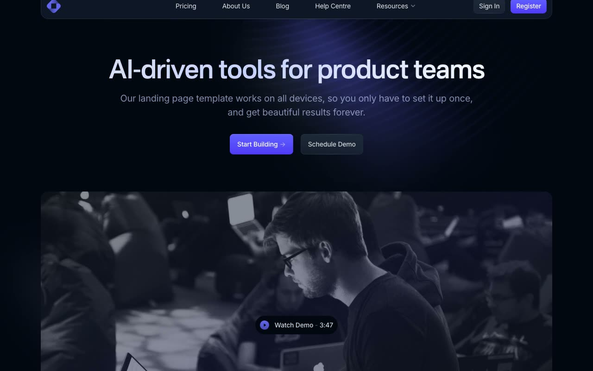

# Open PRO: Dark SaaS Landing Page Template Clone

[](./demo.mp4)

Open PRO is a pixel-faithful clone of Cruip's premium dark-themed multi-page SaaS marketing site template. It spans 12 pages and uses Alpine.js, AOS, and plain HTML, CSS, and JavaScript with no build step. The complete current release includes marketing, authentication, support, and content screens.

## Features

- Animated gradient H1 headline (indigo-to-white shimmer, 6 s linear loop)
- Spotlight hover cards using CSS `--mouse-x` and `--mouse-y` custom properties
- AOS scroll-entrance animations (`ease-out-sine`, 600 ms, fires once, disabled on phones)
- Alpine.js sticky header with resources dropdown and hamburger mobile menu
- Annual / monthly billing toggle on Home and Pricing pages
- Masonry blog grid (15 posts)
- Near-black palette (`#030712`) with indigo-500 (`#6366f1`) accent gradients
- Inter typeface with weights 400 to 900 vendored locally
- All assets vendored locally for offline use

## Pages

| # | Page | File |
|---|------|------|
| 1 | Home | `index.html` |
| 2 | Pricing | `pricing.html` |
| 3 | About Us | `about.html` |
| 4 | Blog | `blog.html` |
| 5 | Blog Post | `blog-post.html` |
| 6 | Help Centre | `help.html` |
| 7 | Newsletter | `newsletter.html` |
| 8 | Contact | `contact.html` |
| 9 | 404 | `404.html` |
| 10 | Sign In | `signin.html` |
| 11 | Sign Up | `signup.html` |
| 12 | Reset Password | `reset-password.html` |

## Tech Stack

| Technology | Role |
|-----------|------|
| Alpine.js | Dropdowns, mobile menu, billing toggle, Alpine transitions |
| AOS (Animate on Scroll) | Scroll-entrance animations |
| Inter | Locally vendored typography with weights 400 to 900 |
| Vanilla HTML / CSS / JS | Markup, layout, spotlight card effect |

No build tool, bundler, or package manager is needed.

## Getting Started

Because there is no build step, open any page directly in a browser:

```
open index.html
```

Or serve the folder with a local static server to avoid any browser CORS restrictions on local assets:

```sh
python3 -m http.server 8080
```

`prompt.md` holds the full build specification. `demo.mp4` shows the template in motion.

## Credits

Faithful clone of an existing design, recreated for study/learning. All credit for the original design goes to its creators.

**Original:** Cruip, https://cruip.com/demos/open-pro/

Part of the [Cruip](../) premium templates in the [Templates](../../../) collection.
