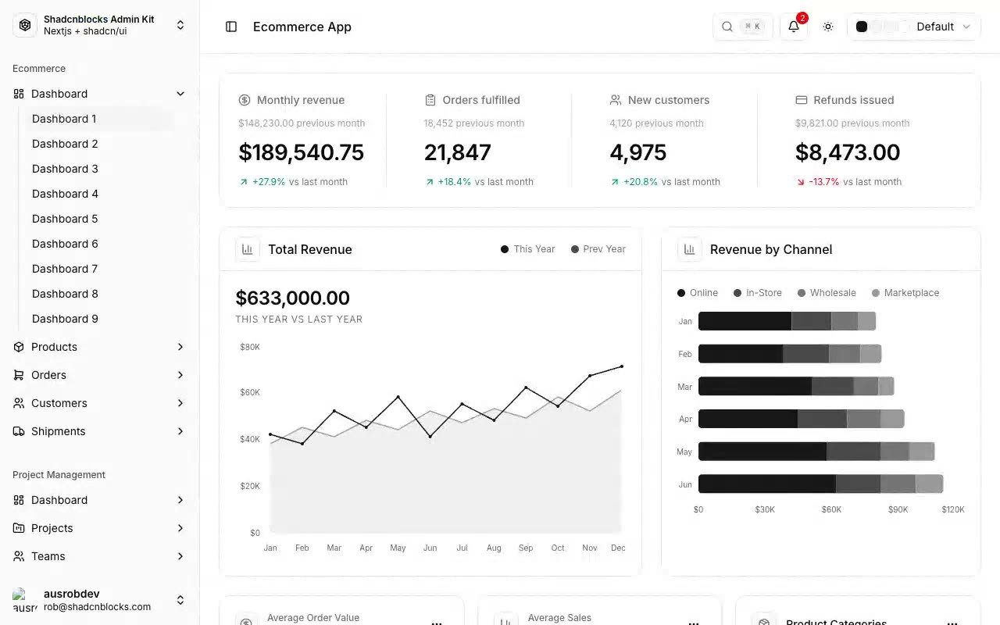

# Shadcnblocks Admin Kit

[](./demo.mp4)

A pixel-faithful static edition of the Shadcnblocks ecommerce admin kit. It includes nine dashboard layouts, two data-table pages, responsive chart geometry, light and dark themes, collapsible desktop navigation, and a mobile navigation drawer.

## Pages

| Path | Description |
|---|---|
| `index.html` | Redirects to the first dashboard |
| `ecommerce/dashboard-1.html` | KPI cards, revenue charts, and category analytics |
| `ecommerce/dashboard-2.html` | Order, customer, refund, and channel analytics |
| `ecommerce/dashboard-3.html` | Revenue, order, and product performance |
| `ecommerce/dashboard-4.html` | Revenue overview and cost breakdown |
| `ecommerce/dashboard-5.html` | Revenue summary and category performance |
| `ecommerce/dashboard-6.html` | Fulfillment and returns analytics |
| `ecommerce/dashboard-7.html` | Platform and channel dashboard overview |
| `ecommerce/dashboard-8.html` | Revenue and conversion metrics |
| `ecommerce/dashboard-9.html` | Tabbed ecommerce analytics overview |
| `original/users.html` | User management table |
| `original/tasks.html` | Task management table |

## Run

Serve the repository with a static server so the responsive chart data can load:

```sh
python3 -m http.server 8080
```

Then open `http://localhost:8080/templates/premium/cruip/shadcnblocks-admin/`.

## Reference

The original design is available at <https://shadcnblocks-admin.vercel.app/>.
