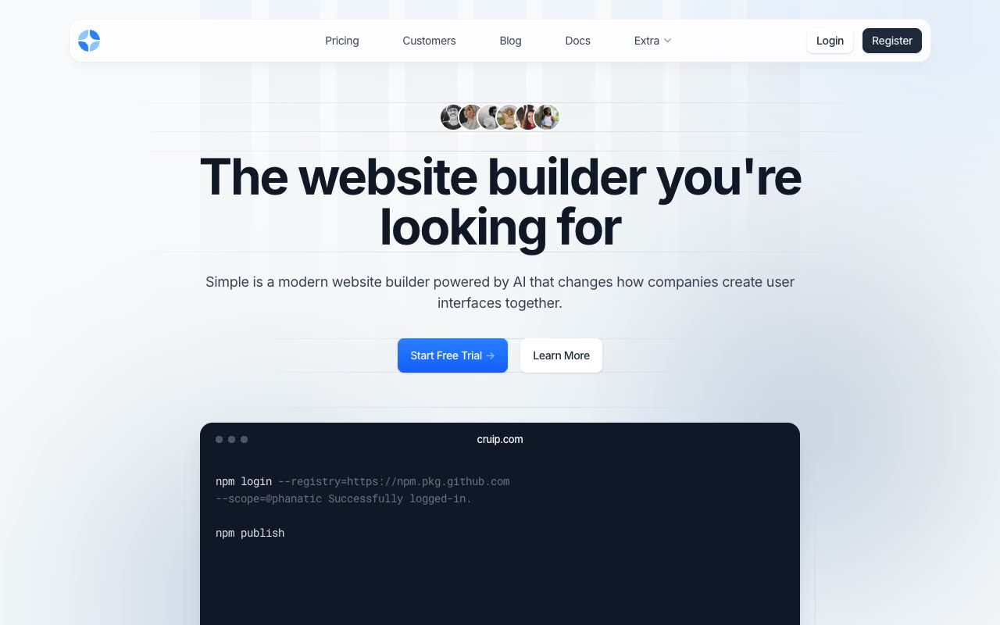

# Simple

[](./demo.mp4)

A pixel-faithful static edition of the Cruip Simple website builder template. It includes thirteen pages, responsive navigation, category tabs, pricing controls, FAQ accordions, animated sections, forms, and complete legal content.

## Pages

- `index.html`: landing page
- `pricing.html`: pricing plans, comparison table, and FAQ
- `customers.html`: customer stories and video testimonials
- `blog.html`: article listing
- `blog-post.html`: complete article layout
- `documentation.html`: documentation and code examples
- `support.html`: support center
- `apps.html`: integration catalog
- `signin.html`: sign-in form
- `signup.html`: registration form
- `reset-password.html`: password reset form
- `terms.html`: terms of service
- `privacy.html`: privacy policy

## Run

No build step is required. Serve the repository with a static server:

```sh
python3 -m http.server 8080
```

Then open `http://localhost:8080/templates/premium/cruip/simple/`.

## Reference

The original design is available at <https://cruip.com/demos/simple/>.
