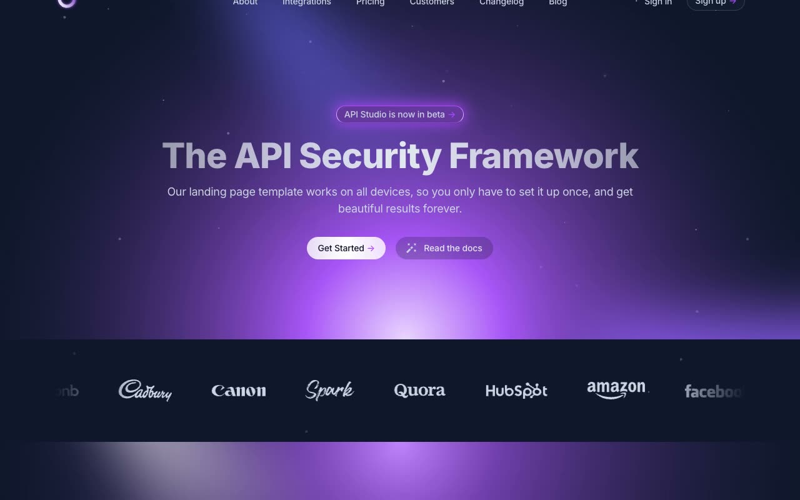

# Stellar

[](./demo.mp4)

A locally vendored reproduction of Cruip's Stellar marketing template with all sixteen current routes.

## Pages

- Home
- About
- Integrations
- Integration detail
- Pricing
- Customers
- Customer story
- Changelog
- Blog
- Blog post
- Contact
- Sign in
- Sign up
- Reset password
- Terms
- Privacy

## Running locally

```bash
python3 -m http.server 8080
```

Open `http://localhost:8080/templates/premium/cruip/stellar/`.

The template uses local CSS, JavaScript, images, fonts, and favicon assets. It does not require a build step.

[Back to templates](../../../README.md)
