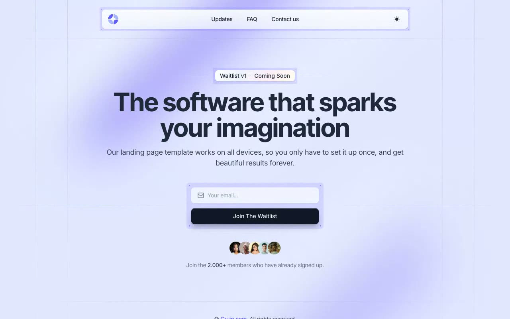

# Waitlist

[](./demo.mp4)

A locally vendored reproduction of Cruip's Waitlist landing page.

## Running locally

```bash
python3 -m http.server 8080
```

Open `http://localhost:8080/templates/premium/cruip/waitlist/`.

The page uses local CSS, JavaScript, fonts, images, and favicon assets. It does not require a build step.

[Back to templates](../../../README.md)
