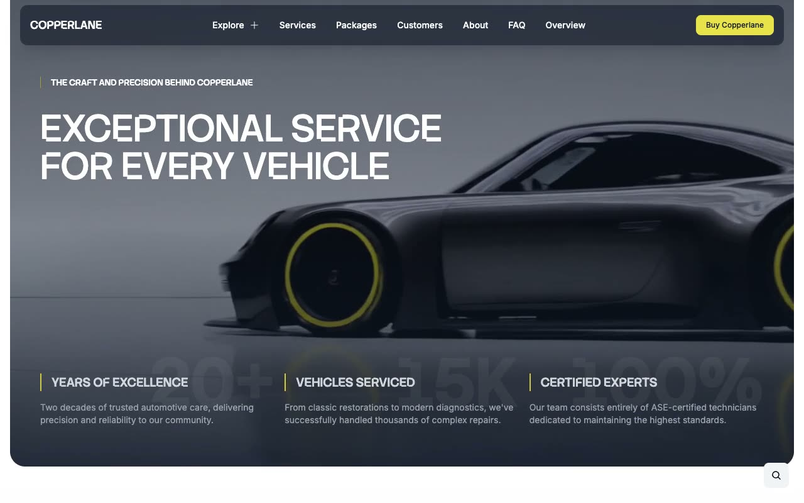

# Copperlane: Automotive Services Website Template

[](./demo.mp4)

Copperlane is a 22-page business template for an automotive service center. Its design combines Stack Sans Notch display type, Inter body copy, dark navigation, high-contrast imagery, and bright yellow accents. The template includes service and package details, customer stories, appointment and contact forms, responsive navigation, search, FAQ disclosures, and video backgrounds.

## Run

Serve the project folder with any static file server and open it in a browser.

```sh
python3 -m http.server 8080
```

## Key interactions

- **Desktop navigation:** The Explore control opens a three-column menu for services, resources, and company links.
- **Mobile navigation:** The menu button opens a responsive navigation panel.
- **Search:** The floating search control opens site-wide search.
- **FAQ disclosures:** Each question expands to reveal its answer.
- **Forms:** Appointment and contact pages provide structured input controls.
- **Media:** Local video assets power the home, about, and footer backgrounds.

## Primary routes

- `index.html`
- `services.html`
- `service-packages.html`
- `customers.html`
- `about.html`
- `team.html`
- `faq.html`
- `contact.html`
- `book-appointment.html`
- `blog.html`
- `jobs.html`

Additional service, package, customer, and system detail pages are organized in their matching subdirectories.

## Credits

The original design is from [Lexington Themes](https://lexingtonthemes.com/viewports/copperlane).

Part of the [Templates](../../README.md) collection.
