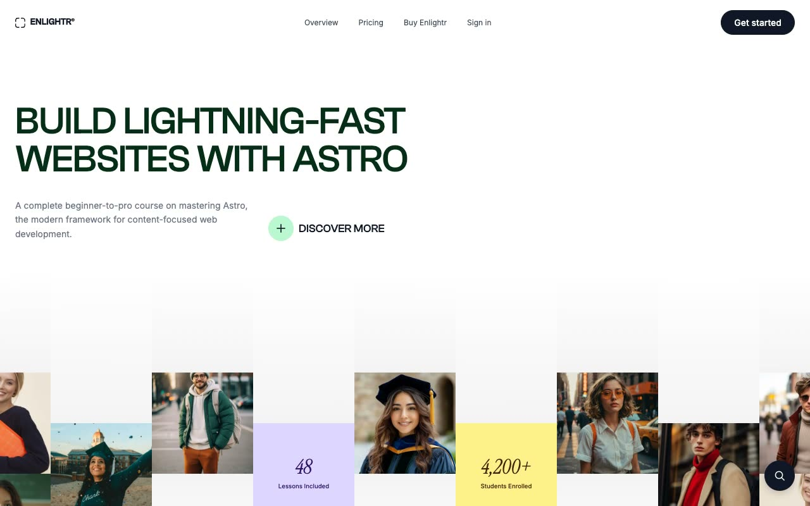

# Enlightr: Multi-Page Online Course Website Template

[](./demo.mp4)

Enlightr is a five-page educational platform and online course template. It combines a white canvas with green accents, Inter Variable body copy, Instrument Serif display type, Clash Grotesk labels, and Space Mono details. It includes a testimonial carousel, pricing comparison, FAQ disclosures, responsive navigation, floating search, authentication, and a complete route overview.

## Run

Serve the project folder with a local static server.

```sh
python3 -m http.server 8080
```

## Routes

- `index.html`
- `pricing.html`
- `courses.html`
- `sign-in.html`
- `system-overview.html`

## Key interactions

- **Responsive navigation:** The menu control opens a full-screen mobile panel.
- **Search:** The floating control opens the course search interface.
- **Testimonials:** Student stories are arranged in a responsive horizontal carousel.
- **Pricing:** The monthly and annual controls update the active billing state.
- **FAQ:** Pricing questions expand through native disclosure controls.
- **System overview:** A compact index provides direct access to the template's route groups.

## Credits

The original design is from [Lexington Themes](https://lexingtonthemes.com/viewports/enlightr).

Part of the [Templates](../../README.md) collection.
