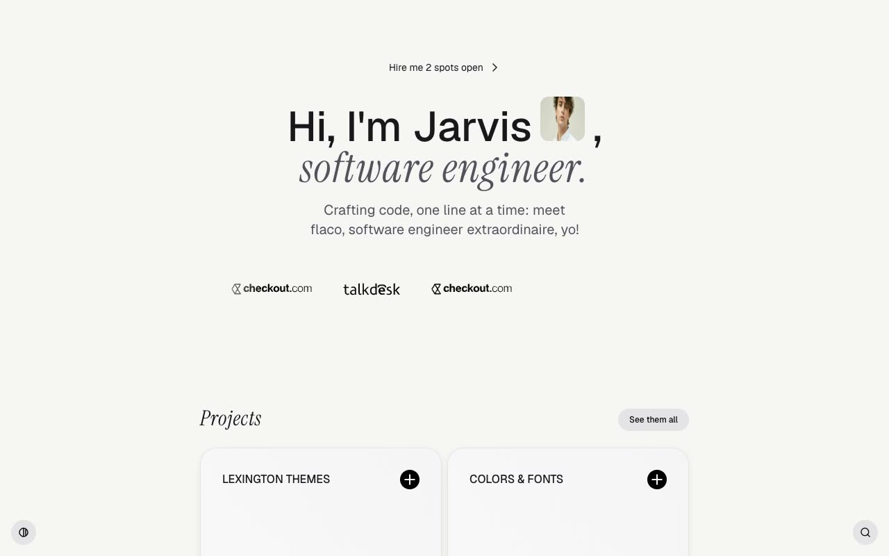

# Flaco: Minimal Personal Portfolio and Blog Template

[](./demo.mp4)

Flaco is a pixel-faithful static implementation of the Flaco template by Lexington Themes. It is a minimal personal portfolio and blog site for a fictional software engineer named Jarvis. Built with HTML, CSS, and JavaScript, it includes six pages: Home, Blog, Projects, Store, Studio, and Stack. The design features a warm neutral palette with a lime-green accent, a light and dark theme toggle persisted to `localStorage`, a Fuse.js-powered fuzzy search modal, an animated brand logo marquee, and detailed hover interactions. Fonts are Geist, Instrument Serif italic, and Geist Mono.

## Run

No build step required. Open `index.html` directly in a browser, or serve the folder locally:

```sh
python3 -m http.server
```

Then visit `http://localhost:8000` in your browser.

## Pages

| File | Page |
|---|---|
| `index.html` | Home: hero, brand marquee, projects grid, featured blog post, stack preview |
| `blog/index.html` | Blog: paginated post list |
| `projects/index.html` | Projects: full project grid |
| `store/index.html` | Store: digital goods listing |
| `studio/index.html` | Studio: services and hire-me page |
| `stack/index.html` | Stack: full tech stack listing |

## Notable techniques

- **Light and dark theme:** toggled by a fixed bottom-left pill button. It writes `.dark` on `<html>` and persists the choice to `localStorage`.
- **Fuzzy search:** a fixed bottom-right button opens a full-screen modal backed by [Fuse.js](https://fusejs.io/) for instant fuzzy search over blog post data.
- **Animated marquee:** the brand logo ticker uses a 12-second linear infinite CSS animation with left and right fade masks.
- **Hamburger overlay menu:** a full-screen overlay uses `backdrop-filter: blur` and staggered per-link entrance animations.
- **Stack cards:** a horizontal row uses subtle static rotations, with logo icons rotating on hover.
- **Project card hover:** the description block slides up from below while the arrow icon rotates.

`prompt.md` holds the full build specification and `demo.mp4` shows the template in motion.

## Credits

Faithful clone of an existing design, recreated for study/learning. All credit for the original design goes to its creators.

**Original:** [Lexington Themes](https://lexingtonthemes.com/viewports/flaco)
