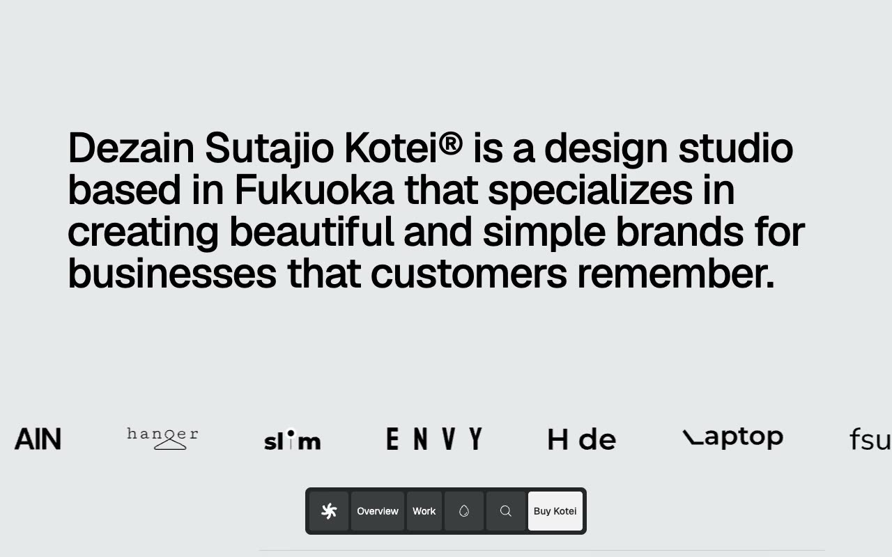

# Kotei: Design Studio Portfolio Template

[](./demo.mp4)

Kotei is a multi-page design studio portfolio website based on the Lexington Themes premium template. It presents a minimal, typographically driven aesthetic suited to branding studios, creative agencies, and independent designers. Key interactions include a floating dock navigation bar, a light and dark mode toggle, scroll-triggered AOS animations, an animated client logo marquee, Fuse.js full-text search, and a live Helsinki clock in the footer.

## Pages

| Route | Description |
|---|---|
| `index.html` | Home: hero statement, services list, featured work grid, philosophy section, insights preview |
| `work/index.html` | Work index: full portfolio case study listing |
| `blog/index.html` | Blog / Insights index |

## Tech Stack

- **HTML/CSS/JS:** no framework or build tooling
- **Tailwind CSS v4:** precompiled to `assets/kotei.css` and `assets/supplements.css`
- **Geist / Geist Mono:** loaded from Google Fonts
- **AOS 2.3.1:** scroll-triggered fade and slide animations
- **Fuse.js 6.6.2:** client-side fuzzy search across blog and work entries
- **Dark mode:** `localStorage`-persisted preference with `prefers-color-scheme` fallback

## Running Locally

No build step. Open the template directly in a browser:

```sh
open index.html
```

Or serve it over HTTP to avoid any browser same-origin restrictions on local files:

```sh
python3 -m http.server 8080
```

All assets (CSS, images, logos) resolve relative to the file, so the template works correctly from any static file server.

`demo.mp4` shows the template in motion and `prompt.md` contains the build specification.

## Credits

Faithful clone of an existing design, recreated for study/learning. All credit for the original design goes to its creators.

**Original:** [Lexington Themes](https://lexingtonthemes.com/viewports/kotei)
