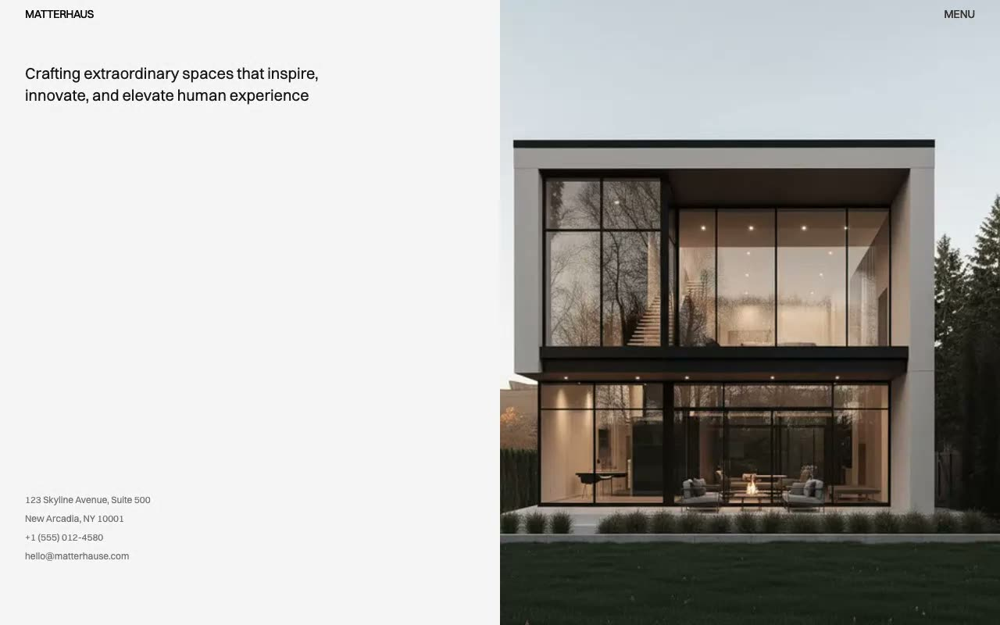

# Matterhaus: Architecture Studio Website Template Clone (Vanilla HTML/CSS/JS + Tailwind CSS v4)

[](./demo.mp4)

Matterhaus is a pixel-faithful clone of the Matterhaus architecture studio theme by Lexington Themes. The minimal, editorial multi-page design uses a recurring two-column split layout, a fixed header with `mix-blend-difference` navigation, sticky metadata columns, and full-height image or content panels. All discovered page types are reproduced in plain HTML with Tailwind CSS v4 utility classes, the Switzer variable font, a mobile menu, and full-site search.

## Run

No build step is required. All files are plain HTML, CSS, and JavaScript.

```sh
open index.html

python3 -m http.server 8000
```

## Pages

The clone reproduces all discovered pages from the original:

- **Home** (`index.html`): split hero with headline and contact details on the left, full-height image on the right
- **Projects** (`projects/index.html`): sticky heading and a list of 10 projects
- **Project Detail** (`projects/[slug].html` × 10): sticky metadata, image gallery, and prose
- **Services** (`services/index.html` + 8 detail pages): services listing and individual service pages
- **Studio** (`studio/index.html`): studio profile with two-column text and a full-height image
- **Contact** (`contact/index.html`): contact information and imagery
- **Careers** (`careers/index.html` + 5 detail pages): career listings and job details
- **Blog** (`blog/index.html` + 4 posts + tags pages): journal listing, posts, and tag pages
- **Team** (`team/index.html` + 2 member pages): team grid and individual profiles
- **Awards** (`awards/index.html`), **Process** (`process/index.html`): standalone information pages
- **System** (`system/overview.html` + colors, typography, buttons, links): design system documentation
- **Legal** (`legal/` × 5: terms, privacy, cookies, copyright, disclaimer)
- **404** (`404.html`)

## Interactions

- **Mobile menu**: hamburger toggle reveals the navigation panel
- **Search modal**: full-site fuzzy search triggered by the Search button, `/`, or `Cmd/Ctrl+K`, with `Esc` to close

## Notes

`prompt.md` contains the full build specification with design token documentation and page-by-page layout breakdown. `demo.mp4` shows the clone in motion.

Switzer is loaded from Fontshare, and page imagery is loaded from the original reference deployment. The template itself uses plain HTML, CSS, and JavaScript.

## Credits

Faithful clone of an existing design, recreated for study/learning. All credit for the original design goes to its creators.

**Original:** Lexington Themes, <https://lexingtonthemes.com/viewports/matterhaus>
