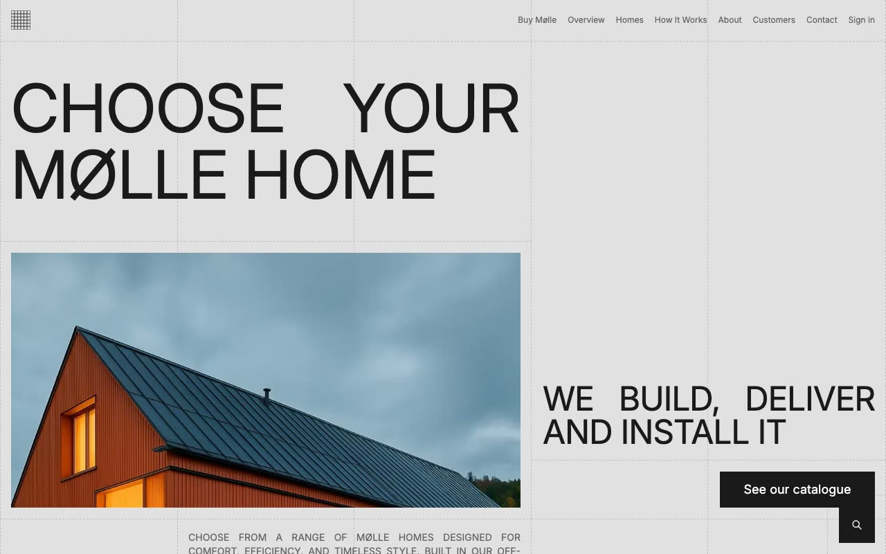

# Mølle: Scandinavian Prefab Home Website Template

[](./demo.mp4)

Mølle is a pixel-faithful clone of the premium Lexington Themes template. Its Scandinavian visual system combines a strict five-column grid, dashed borders, uppercase Inter typography, a monochrome palette, and a focused purple accent.

## Pages

The project contains all 65 pages currently reachable from the live reference:

- Home, homes, process, about, customers, contact, sign-in, and sign-up pages
- 8 individual product pages and 23 product tag pages
- 6 blog posts, the blog index, and 10 blog tag pages
- 2 customer detail pages
- 5 design-system pages
- Legal terms and a custom 404 page

## Interactions

- Responsive full-screen mobile navigation
- Full-site fuzzy search across blog posts and products
- Draggable product carousel with previous and next controls
- Native FAQ accordions
- Product, navigation, and button hover states

## Run locally

```bash
python3 -m http.server 8080
```

Open <http://localhost:8080>.

The template uses plain HTML, CSS, and JavaScript. Page imagery and compiled runtime assets load from the original reference deployment, while Inter loads from rsms.me.

## Credits

Faithful clone of an existing design, recreated for study and learning. All credit for the original design goes to its creators.

**Original:** Lexington Themes, <https://lexingtonthemes.com/viewports/molle>
