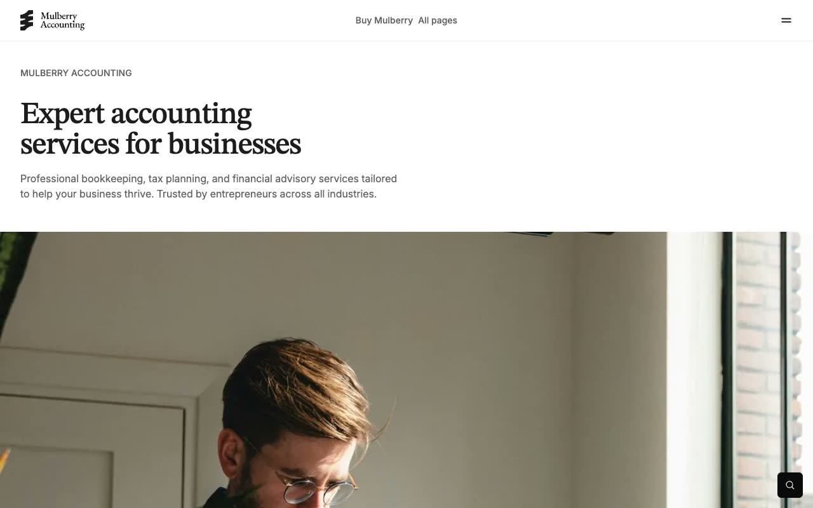

# Mulberry: Premium Accounting Firm Website Template

[](./demo.mp4)

Mulberry is a pixel-faithful clone of the Lexington Themes accounting and financial-services template. It pairs STIX Two Text display headings with Inter body copy, a warm neutral palette, golden accent tones, full-bleed editorial imagery, and strong black call-to-action sections.

## Pages

The project contains all 68 pages currently reachable from the live reference:

- 8 core pages, including home, about, contact, pricing, FAQ, testimonials, locations, and 404
- 7 service pages
- 9 industry pages
- 7 case-study pages
- 23 blog and tag pages
- 7 team pages
- 2 legal pages
- 5 design-system pages

## Interactions

- Full-width mega menu with outside-click and Escape handling
- Full-site fuzzy search with local result links
- Native FAQ accordions
- Scroll-triggered count-up statistics
- Responsive card, navigation, footer, and button hover states

## Run locally

```sh
python3 -m http.server 8080
```

Open <http://localhost:8080>.

The template uses plain HTML, CSS, and JavaScript. Page imagery, the CEO video, and compiled runtime assets load from the original reference deployment. Inter and STIX Two Text load from their font providers.

## Credits

Faithful clone of an existing design, recreated for study and learning. All credit for the original design goes to its creators.

**Original:** Lexington Themes, <https://lexingtonthemes.com/viewports/mulberry>
