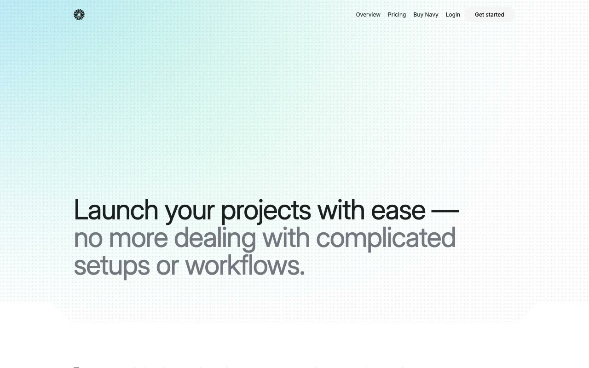

# Navy: SaaS Cloud Hosting Website Template

[](./demo.mp4)

Navy is a pixel-faithful clone of the Lexington Themes cloud infrastructure template. The visual system combines a clean white canvas, teal and green radial bursts, dot overlays, geometric section transitions, responsive tabs, and subtle scroll reveals.

## Pages

The project contains all 81 pages currently reachable from the live reference:

- Home, about, pricing, 404, and 3 form pages
- 7 customer pages
- 20 blog and tag pages
- 5 help-center pages
- 21 integration pages
- 4 changelog pages
- 11 team pages
- 5 design-system pages
- Terms page

## Interactions

- Responsive full-screen mobile navigation
- Interactive feature tabs with dashboard panels
- Intersection-based content reveals
- Customer, integration, and article hover states
- Responsive forms and detail layouts

## Run locally

```sh
python3 -m http.server 8080
```

Open <http://localhost:8080>.

The template uses plain HTML, CSS, and JavaScript. Page imagery and compiled runtime assets load from the original reference deployment. Inter and JetBrains Mono load from their font providers.

## Credits

Faithful clone of an existing design, recreated for study and learning. All credit for the original design goes to its creators.

**Original:** Lexington Themes, <https://lexingtonthemes.com/viewports/navy>
