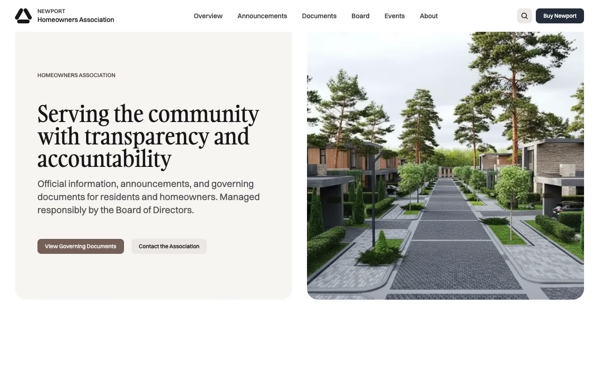

# Newport: Homeowners Association Website Template

[](./demo.mp4)

Newport is a complete static HTML reproduction of the Newport homeowners association website by Lexington Themes. Its calm editorial design combines Gambarino display type, Switzer body type, soft neutral surfaces, rounded cards, and clear information architecture for a community association.

The project contains all 74 pages currently reachable from the live reference, including the home page, system guide, announcements, documents, board profiles, events, amenities, blog posts, tag archives, association information, legal pages, and the not-found page.

## Page groups

- 6 home, association, contact, gallery, governance, and rules pages
- 6 design system and utility pages
- 10 announcement pages
- 11 document pages
- 6 board pages
- 7 event pages
- 12 amenity pages
- 13 blog and tag pages
- 2 legal pages
- 1 not-found page

## Interactions

- Search modal with keyboard shortcuts and real-time filtering
- Responsive mobile navigation panel
- Native FAQ accordions
- Sticky section navigation on long-form pages
- Hover and focus states matching the original interface

## Run

Serve the project directory with any static file server:

```sh
python3 -m http.server 8080
```

Then open `http://localhost:8080`.

## Assets

The page markup and styles mirror the original deployment. Images and fonts load from the provider's published asset URLs.

## Credits

The original Newport design is by [Lexington Themes](https://lexingtonthemes.com/viewports/newport).
