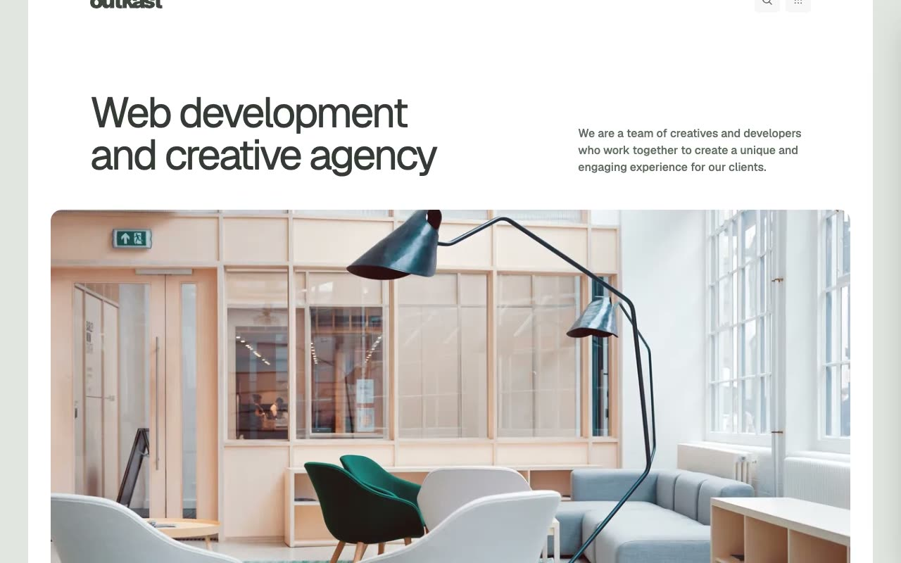

# Outkast: Creative Agency Website Template

[](./demo.mp4)

Outkast is a complete static HTML reproduction of the Outkast creative agency website by Lexington Themes. Its bold visual system combines oversized type, saturated accent colors, rounded editorial cards, and energetic portfolio presentation.

The project contains all 50 pages reachable from the live interface and search index, including services, work, team profiles, pricing, journal posts, tag archives, legal pages, the system guide, and the not-found page.

## Page groups

- 8 primary marketing and content pages
- 6 portfolio details
- 6 service details
- 6 team profiles
- 6 journal posts
- 7 journal tag pages
- 5 legal pages
- 5 design system pages
- 1 not-found page

## Interactions

- Responsive mobile navigation drawer
- Search modal with keyboard controls and real-time filtering
- Keen Slider portfolio carousel
- Responsive pricing and service layouts
- Hover, focus, and card transition states

## Run

Serve the project directory with any static file server:

```sh
python3 -m http.server 8080
```

Then open `http://localhost:8080`.

## Assets

The page markup and styles mirror the original deployment. Images, fonts, and supporting scripts load from the provider's published asset URLs.

## Credits

The original Outkast design is by [Lexington Themes](https://lexingtonthemes.com/viewports/outkast).
