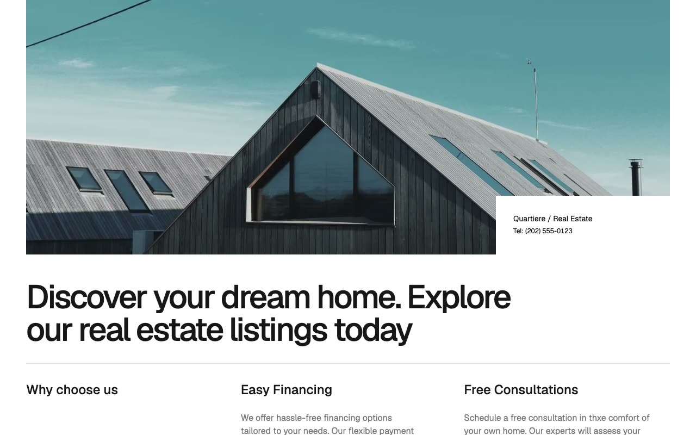

# Quartiere Real Estate Template

[](./demo.mp4)

Quartiere is a static reproduction of the current Lexington Themes luxury real estate template. Its editorial layout combines Geist typography, sharp monochrome styling, property galleries, agent profiles, listing search, booking, and lead forms.

The project contains all 49 valid HTML routes currently reachable from the live reference, including listings, property details, agents, journal posts, tag archives, booking, legal pages, account pages, and design system references.

## Highlights

- Responsive property and agent layouts
- Property search modal with live filtering
- Expandable navigation menu
- Keen Slider property galleries
- Responsive video and map sections
- Static booking embed with matching layout
- Forms for buyers, sellers, and account access

## Run

Serve the project directory with any static file server:

```sh
python3 -m http.server 8080
```

Then open `http://localhost:8080`.

## Assets

Page markup and styles mirror the current reference deployment. Fonts, images, and supporting scripts load from the provider's published asset URLs. The property video is stored locally for consistent playback.

## Credits

The original Quartiere design is by [Lexington Themes](https://quartiere-astro.pages.dev/).
