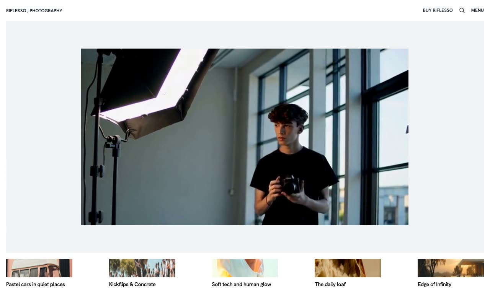

# Riflesso Photography Template

[](./demo.mp4)

Riflesso is a static reproduction of the current Lexington Themes photography portfolio. It combines Hanken Grotesk typography, a full-screen navigation overlay, gallery and magazine grids, photographer profiles, product pages, search, and minimal editorial layouts.

The project contains all 59 HTML routes currently reachable from the live reference, including gallery stories, magazine posts, tag archives, products, studio content, team profiles, legal pages, and design system references.

## Highlights

- Responsive photography and magazine grids
- Full-screen animated navigation
- Search modal with content filtering
- Ten gallery stories and ten magazine posts
- Six product detail pages
- Ten contributor profiles
- Responsive image, video, and editorial layouts

## Run

Serve the project directory with any static file server:

```sh
python3 -m http.server 8080
```

Then open `http://localhost:8080`.

## Assets

Page markup and styles mirror the current reference deployment. Fonts, images, video, and supporting scripts load from the provider's published asset URLs or the included project assets.

## Credits

The original Riflesso design is by [Lexington Themes](https://riflesso-astro.pages.dev/).
