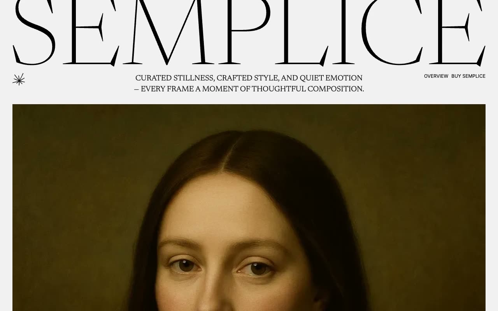

# Semplice Photography Portfolio Template

[](./demo.mp4)

Semplice is a static reproduction of a minimal editorial photography portfolio. The project contains all 54 HTML routes from the current reference, including gallery collections, articles and tag archives, store pages, studio and team profiles, legal content, and system pages.

## Highlights

- Responsive layouts for mobile, tablet, and desktop viewports
- Editorial serif and sans-serif typography pairing
- Full-width wordmark and photography-led gallery layouts
- Working article search and navigation hover states
- Complete local route coverage with working internal links
- Refreshed demonstration video and poster image

## Run

Serve the directory with any static file server:

```sh
python3 -m http.server 8080
```

Then open `http://localhost:8080` in a browser.

## Assets

The existing local photography library is preserved. Current reference images, public font stylesheets, and required browser libraries remain linked to their original sources where needed.

## Credits

The original Semplice design is by [Lexington Themes](https://semplice-astro.pages.dev/).
