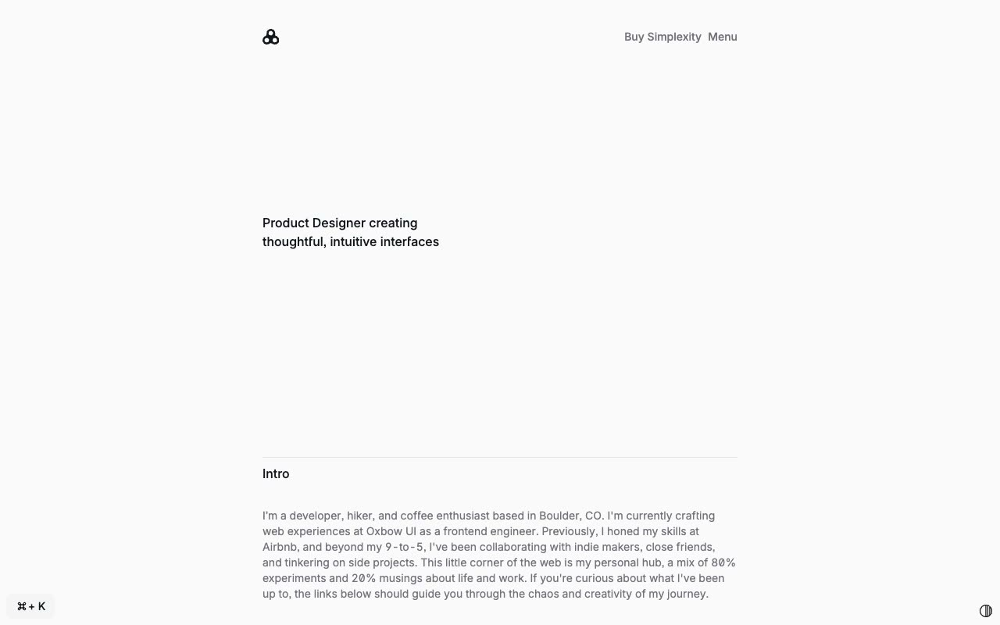

# Simplexity Portfolio and Blog Template

[](./demo.mp4)

Simplexity is a static reproduction of a focused personal portfolio and publishing website. The project contains all 43 valid HTML routes from the current reference, including articles and tag archives, projects, store content, authentication forms, legal pages, and system pages.

## Highlights

- Responsive narrow-column layouts for mobile, tablet, and desktop
- Persistent light and dark themes
- Keyboard-accessible site search
- Expandable navigation menu
- Complete local route coverage with working internal links
- Refreshed demonstration video and poster image

## Run

Serve the directory with any static file server:

```sh
python3 -m http.server 8080
```

Then open `http://localhost:8080` in a browser.

## Assets

The existing local project image library is preserved. Public font stylesheets and required browser libraries remain linked to their original sources where needed.

## Credits

The original Simplexity design is by [Lexington Themes](https://simplexity-astro.pages.dev/).
