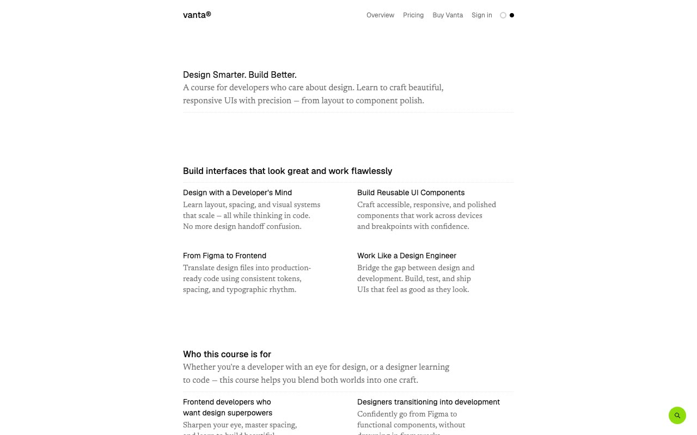

# Vanta Learning Platform Template

[](./demo.mp4)

Vanta is a static reproduction of the current Lexington Themes learning platform design. It includes all 64 discoverable routes as plain HTML, CSS, and JavaScript with no build step.

## Highlights

- Responsive learning and editorial layouts across mobile, tablet, and desktop widths
- Search, mobile navigation, carousel, theme, and pricing interactions
- Course, teacher, customer, project, blog, team, account, legal, and system pages
- Local static routing with complete audit evidence in `.audit`

## Run

```sh
python3 -m http.server 8080
```

Open `http://localhost:8080` in a browser.

## Assets

- `demo.mp4` contains the current interaction recording
- `poster.jpg` is the generated demo poster
- `reference.css` contains the reproduced design styles

## Credits

The original Vanta design is by [Lexington Themes](https://vanta-astro.pages.dev/).
