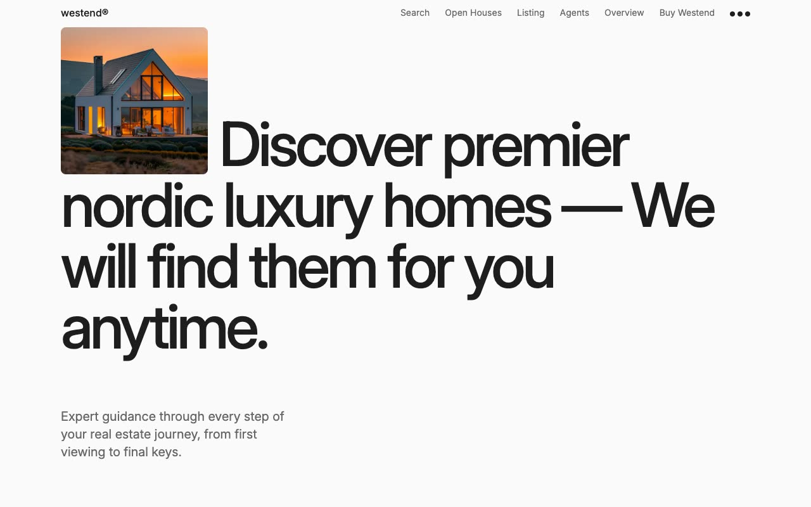

# Westend Real Estate Template

[](./demo.mp4)

Westend is a static reproduction of the current Lexington Themes Nordic real estate design. It includes all 122 discoverable routes as plain HTML, CSS, and JavaScript with no build step.

## Highlights

- Responsive property, agency, editorial, and system layouts across mobile, tablet, and desktop widths
- Search, mobile navigation, and desktop mega-menu interactions
- Property, agent, neighborhood, open house, service, customer, career, resource, and legal detail pages
- Local static routing with complete audit evidence in `.audit`

## Run

```sh
python3 -m http.server 8080
```

Open `http://localhost:8080` in a browser.

## Assets

- `demo.mp4` contains the current interaction recording
- `poster.jpg` is the generated demo poster
- `reference.css` contains the reproduced design styles

## Credits

The original Westend design is by [Lexington Themes](https://westend-astro.pages.dev/).
