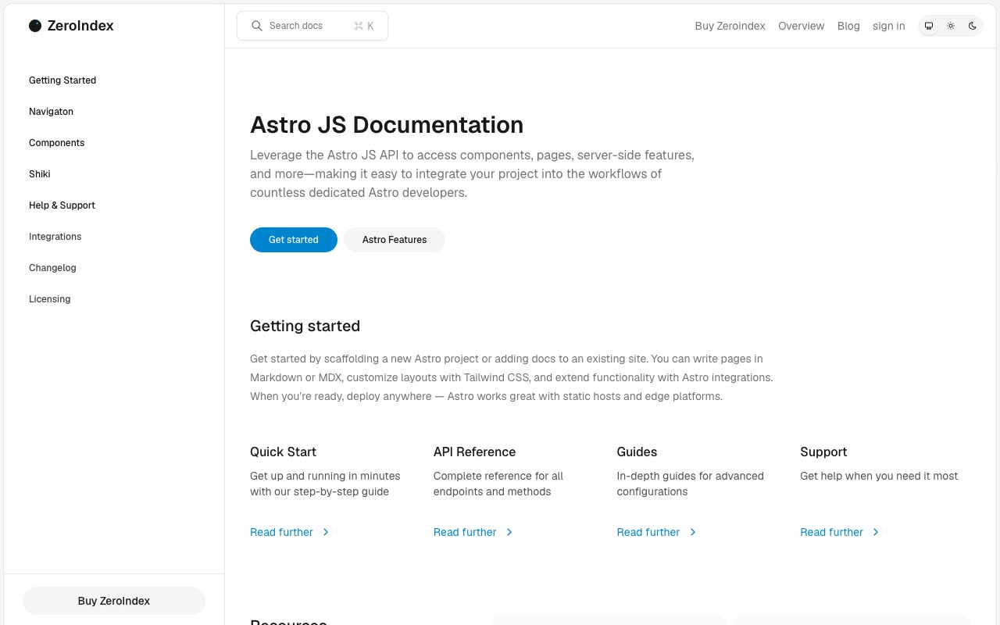

# Zeroindex Documentation Template

[](./demo.mp4)

Zeroindex is a static reproduction of the current Lexington Themes documentation and SaaS design. It includes all 109 discoverable routes as plain HTML, CSS, and JavaScript with no build step.

## Highlights

- Responsive documentation, integration, editorial, account, team, billing, and system layouts across mobile, tablet, and desktop widths
- Documentation search, mobile sidebar, theme, tabs, and accordion interactions
- API, guide, component, example, support, changelog, integration, blog, team, policy, and status pages
- Local static routing with complete audit evidence in `.audit`

## Run

```sh
python3 -m http.server 8080
```

Open `http://localhost:8080` in a browser.

## Assets

- `demo.mp4` contains the current interaction recording
- `poster.jpg` is the generated demo poster
- `reference.css` contains the reproduced design styles

## Credits

The original Zeroindex design is by [Lexington Themes](https://zeroindex-astro.pages.dev/).
