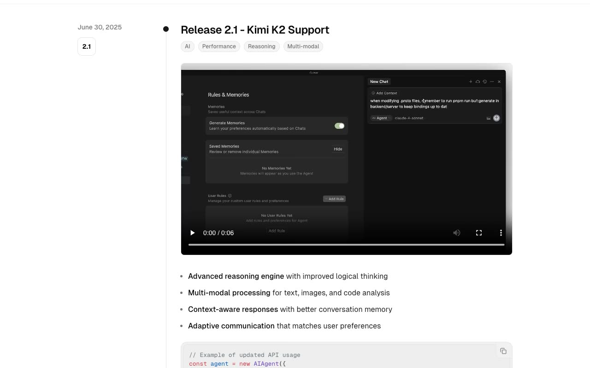

# Changelog Template

A responsive release notes timeline reproduced from the Magic UI Changelog reference in static HTML, CSS, and JavaScript.

## Features

- Three dated release entries
- Version and category badges
- Video, image, and code media
- Expandable feature and bug-fix sections
- Copy control for the code example
- Persistent light and dark themes
- Responsive timeline layout

## Run locally

Serve this directory with any static file server and open `index.html`.

## Reference

[Magic UI Changelog](https://changelog-magicui.vercel.app/)
