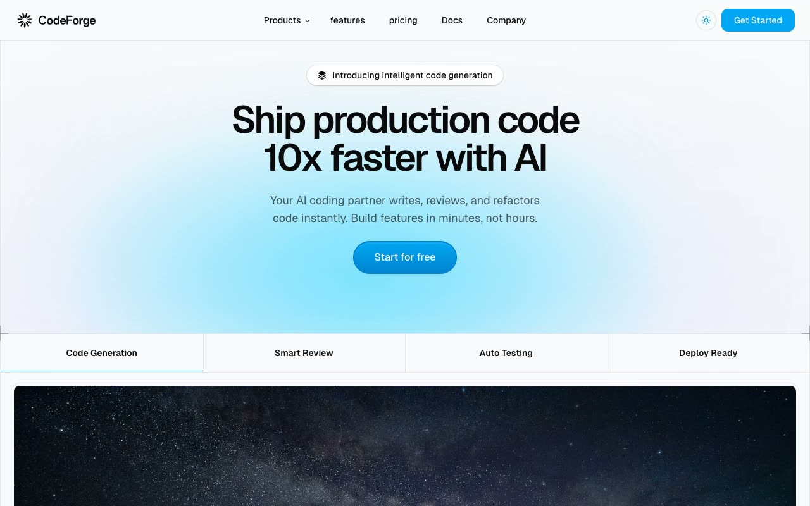

# CodeForge SaaS Landing Page

[](./demo.mp4)

A self-contained, single-page implementation of the Magic UI CodeForge marketing template. The page includes responsive navigation, light and dark themes, product feature sections, testimonials, monthly and annual pricing, FAQ accordions, and conversion sections.

## Run

Serve this folder with any static file server:

```sh
python3 -m http.server
```

Open the printed local URL in a browser.

## Verification

The audit evidence in `.audit/` covers the reference and local page at 390, 768, and 1280 pixels. It also verifies both themes, the mobile menu, product navigation, pricing period selection, FAQ expansion, console output, and network requests.

## Reference

Original design: [Magic UI CodeForge](https://codeforge-magicui.vercel.app/)
