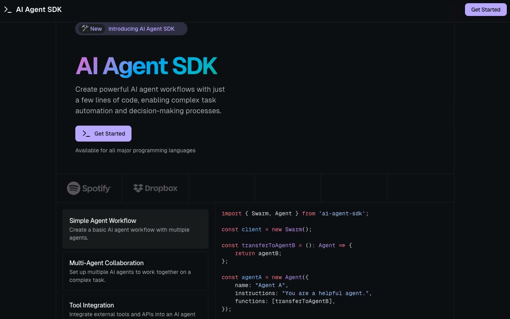

# Devtool Agent SDK Landing Page

[](./demo.mp4)

A static, responsive implementation of the Magic UI Devtool template. The six-page site includes the marketing home page, the live reference's download response, a blog index, and three article pages. The home page includes responsive navigation, feature tabs, pricing period controls, product sections, testimonials, community content, and conversion sections.

## Run

Serve this folder with any static file server:

```sh
python3 -m http.server
```

Open the printed local URL in a browser.

## Verification

The audit evidence in `.audit/` covers all six routes at 390, 768, and 1280 pixels. It also verifies the mobile drawer, feature selection, monthly pricing, console output, and network requests.

## Reference

Original design: [Magic UI Devtool](https://devtool-magicui.vercel.app/)
