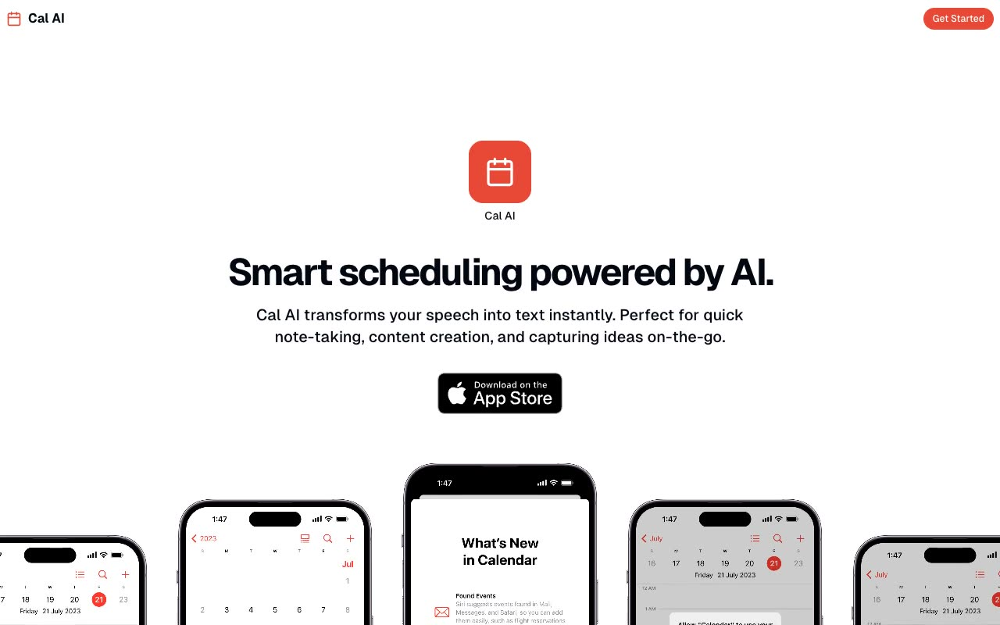

# Cal AI Mobile Landing Page

[](./demo.mp4)

A responsive mobile app landing page with a parallax device hero, alternating product features, a benefits carousel, testimonial masonry, pricing, an accessible FAQ accordion, and an animated call to action.

## Run

Serve the folder with any static web server:

```sh
python3 -m http.server 8000
```

Open `http://localhost:8000/index.html`.

## Reference

The visual reference is the [Magic UI Mobile template](https://mobile-magicui.vercel.app/).
