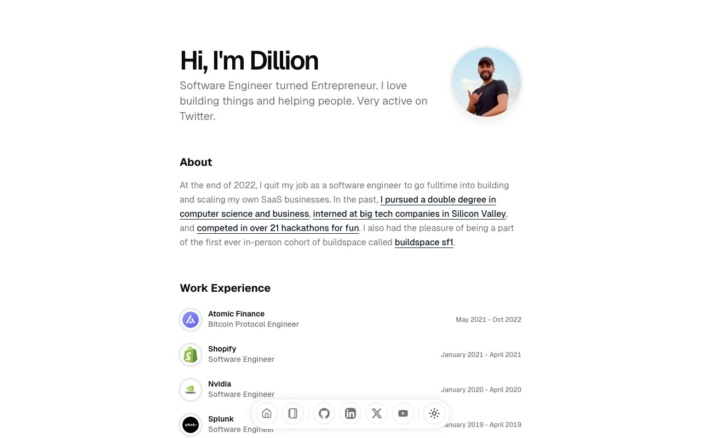

# Magic UI Portfolio template

[](./demo.mp4)

A responsive recreation of the Magic UI developer portfolio. It includes the complete portfolio homepage, both blog index pages, and seven article routes, with theme switching, expandable work history, project video interactions, local pagination, and the floating dock.

## Pages

- `index.html`: Portfolio homepage
- `blog.html`: Blog index, page one
- `blog-page2.html`: Blog index, page two
- `blog-*.html`: Seven individual articles

## Run locally

Serve this directory with any static web server, then open `index.html`.

```sh
python3 -m http.server 8000
```

The visual reference is the [Magic UI Portfolio template](https://portfolio-magicui.vercel.app/).
