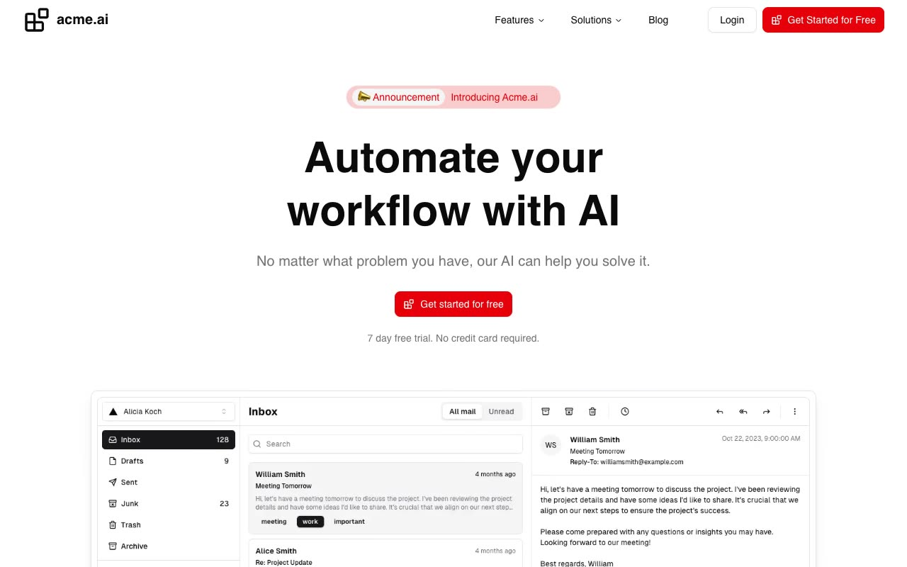

# acme.ai SaaS template

[](./demo.mp4)

A responsive, five-page recreation of the Magic UI acme.ai SaaS template. The site includes the marketing homepage, blog index, article, login, and signup routes, with working navigation menus, mobile drawer, product preview, feature controls, carousel, pricing switch, and FAQ accordion.

## Pages

- `index.html`: Marketing homepage
- `blog.html`: Blog index
- `blog/introducing-acme-ai.html`: Blog article
- `login.html`: Login page
- `signup.html`: Signup page

## Run locally

Serve this directory with any static web server, then open `index.html`.

```sh
python3 -m http.server 8000
```

The visual reference is the [Magic UI SaaS template](https://saas-magicui.vercel.app/).
