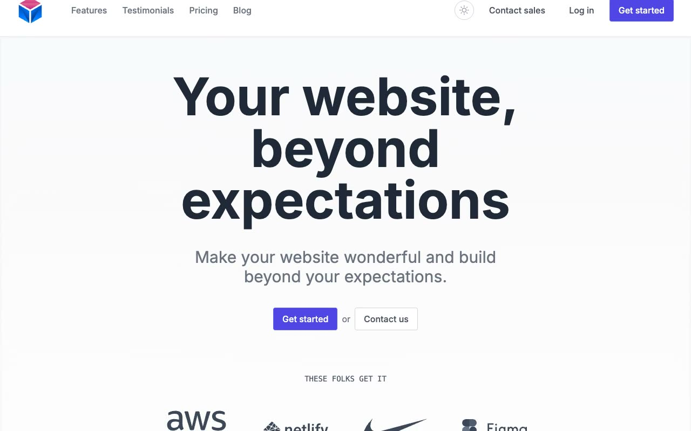

# STARTD: SaaS Landing Page Template Clone (Vanilla HTML/CSS/JS)

[](./demo.mp4)

A pixel-faithful, self-contained reproduction of the STARTD SaaS/startup landing page template, rebuilt as plain HTML, CSS, and vanilla JavaScript with no build step and all assets vendored locally. The single-page layout includes a mobile navigation menu, hero, logo strip, business transformation list, feature grid, case studies, testimonial carousel, pricing panel, and newsletter form. It also includes a persisted light and dark theme toggle.

## Run

This is a static site with no dependencies or build tooling. Serve the folder with:

```sh
python3 -m http.server
```

or simply open `index.html` directly in a browser.

## Notes

- **Theme toggle**: `js/main.js` toggles a `dark` class on the root element and persists the choice to `localStorage` under the key `startd-theme`. The original template ships light-mode only (with an already-dark case-studies band); the dark-mode surface/card/text inversion is an addition made for this clone.
- **Particle background**: the "What Will You Build?" case-studies section renders an animated, slowly drifting/pulsing particle-dot field in `js/main.js`, matching the original's dark navy band.
- **Testimonial carousel**: prev/next buttons step through a 2-item testimonial array, with the prev arrow disabled at index 0 and the next arrow disabled at the last index.
- `prompt.md` contains the full build spec (structure, palette, type scale, and interaction list); `demo.mp4` shows the page, theme toggle, and carousel in motion.

## Credits

Faithful clone of an existing design, recreated for study/learning. All credit for the original design goes to its creators.

**Original:** STARTD template by jkytoela, <https://next-startd.vercel.app>

---

Part of the [Templates](../../) collection. [Browse the live gallery](https://pulkitxm.com/claude-directory).
