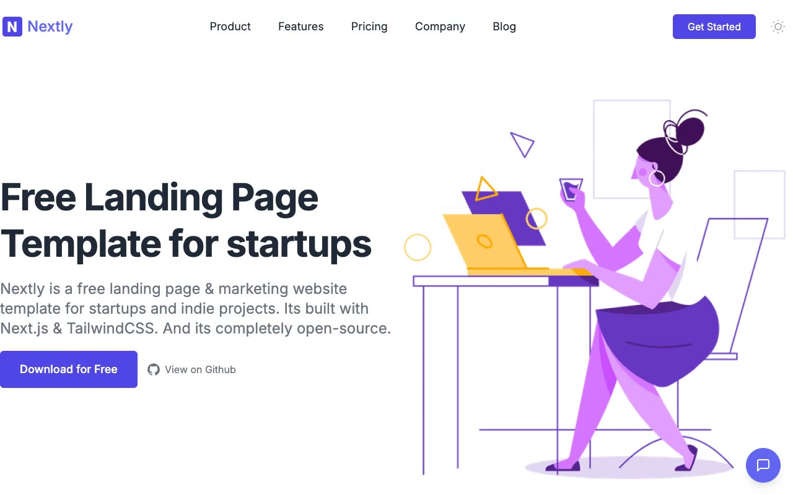

# Nextly Landing Page Template

[](./demo.mp4)

Nextly is a responsive startup landing page based on the Web3Templates reference design. The single-page layout includes a navigation bar, hero illustration, customer logo cloud, alternating benefit sections, video promotion, testimonials, FAQ, call to action, footer, and contact form widget.

## Run

Serve the folder with any static web server:

```sh
python3 -m http.server 8000
```

Then open `http://localhost:8000/index.html`.

## Interactions

- Toggle light and dark themes with persisted preference
- Open the responsive navigation below 1024 pixels
- Expand each FAQ independently
- Open and close the responsive contact form widget
- Play the embedded promotional video

## Structure

- `index.html` contains the complete page
- `styles.css` contains the responsive layout and theme styles
- `script.js` handles themes and interactive controls
- `assets/` contains local images and fonts

## Reference

[Nextly by Web3Templates](https://nextly.web3templates.com)
