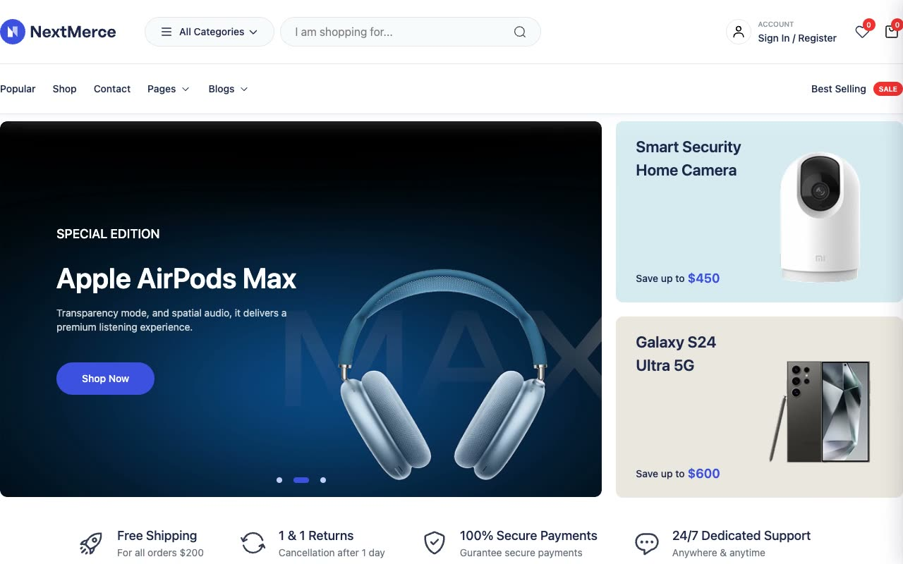

# NextMerce: SaaS E-commerce Storefront Template Clone (Vanilla HTML/CSS/JS + Swiper)

[](./demo.mp4)

A self-contained, pixel-faithful clone of the NextMerce e-commerce template, a bright and conversion-focused online-electronics storefront. It is rebuilt as a static multi-page site in plain HTML, CSS, and vanilla JavaScript with Swiper carousels, runnable offline with no build step. It reproduces the full storefront across 18 pages, including the home page, shop listings, product details, cart, checkout, wishlist, blog, contact, authentication, mail-success, and 404 views. Shared interactions include the sticky header, navigation dropdowns, mini-cart drawer, quick-view modal, quantity steppers, tabs, and carousels.

## Run

This is a static multi-page HTML site with no build or install needed. Serve the folder over a local web server so relative asset paths resolve, then open `index.html`:

```sh
python3 -m http.server 8000
# then visit http://localhost:8000/
```

All pages, fonts (the template's rendered system-sans stack), logos, icons, promo art and product imagery are vendored locally under `assets/`. Swiper is bundled under `assets/vendor/`.

## How it was built

The pages were generated from captured reference DOM under `.reference/` by the helper script in `tools/build-pages.py`, which extracts each page body, strips Next.js runtime artifacts and inline Swiper state, rewrites image/route links to the local static files, and wraps everything in a shared shell that links `assets/css/vendor.css`, `assets/css/app.css` and the Swiper bundle. Interaction behavior (dropdowns, mini-cart drawer, quick-view modal, gallery swap, quantity steppers, tab switching, countdown timer, carousels) lives in `assets/js/app.js`.

The full build spec, including every page, token, layout detail, and reproduced interaction, is documented in `prompt.md`.

## Credits

Faithful clone of an existing design, recreated for study/learning. All credit for the original design goes to its creators.

**Original:** NextMerce, <https://demo.nextmerce.com/>

---

Part of the [Templates](../../../) collection. [Browse the live gallery](https://pulkitxm.com/claude-directory).
