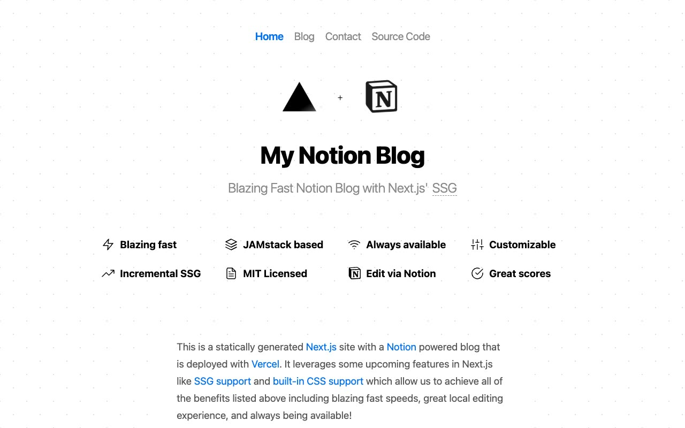

# My Notion Blog: Notion-Powered Blog Template Clone

[](./demo.mp4)

A pixel-faithful static recreation of the Notion-powered blog template originally built by Vercel engineer JJ Kasper. It reproduces the home, blog listing, and contact pages with the original layout, typography, polka-dot background, feature grid, navigation, and deploy footer. The implementation uses plain HTML, CSS, and inline SVG icons with no build tools or frameworks.

## Pages

| File | Route equivalent |
|---|---|
| `index.html` | `/`: Home / feature overview |
| `blog.html` | `/blog`: Blog post listing |
| `contact.html` | `/contact`: Author contact page |

Shared styles live in `styles.css`. Static assets (logos, avatar, deploy button) are in `assets/images/`.

## Run

No build step required. Open any page directly in a browser:

```sh
open index.html
```

Or serve the folder with a local static server so inter-page links resolve correctly:

```sh
python3 -m http.server
# then open http://localhost:8000
```

## Design notes

- **Background**: a double-layer `radial-gradient` dot pattern at a 50 px grid with `background-attachment: fixed`, matching the original exactly.
- **Type scale**: system sans-serif stack at 20 px base; H1 at 2.25 rem / 800 weight with −0.05 rem letter-spacing; H2 at 1.25 rem / 300 weight.
- **Colour palette**: Vercel blue `#0070f3` for active nav links and CTAs; `#3291ff` on hover; muted greys via `--accents-1` through `--accents-3`.

`prompt.md` contains the full build specification. `demo.mp4` shows the finished result in motion.

## Credits

Faithful clone of an existing design, recreated for study/learning. All credit for the original design goes to its creators.

**Original:** Vercel / ijjk (JJ Kasper), <https://notion-blog.vercel.app/>

---

Part of the [Templates](../../) collection in the [Vercel](../) provider group. [Browse the live gallery](https://pulkitxm.com/).
