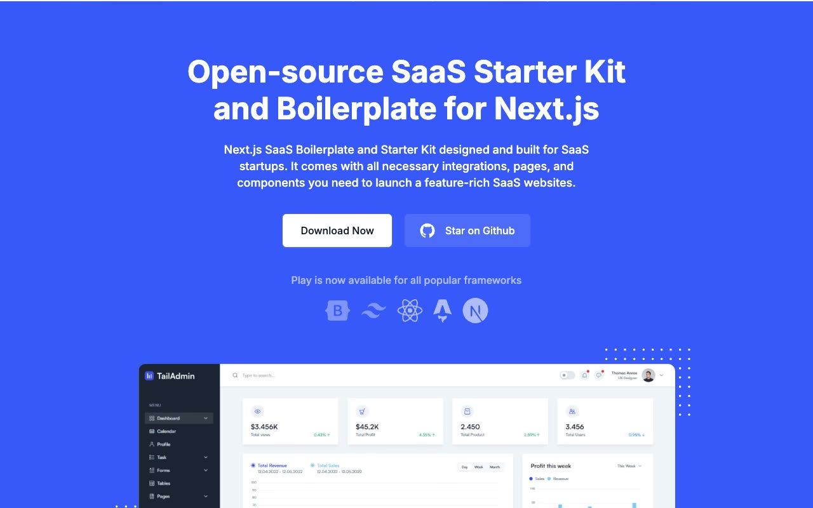

# Play: Next.js SaaS Landing Page Template Clone

[](./demo.mp4)

Play is a pixel-faithful, self-contained clone of the "Play" Next.js SaaS starter kit and boilerplate marketing template by GrayGrids / Next.js Templates. The multi-page site reproduces the long-form home page, About, Pricing, Contact, Blog grid, three blog details, authentication pages, and a 404-style error page. It includes the original blue and navy design system, Inter typeface, light and dark themes, sticky header, dropdown navigation, mobile menu, forms, and entrance animations. Everything runs offline with locally vendored fonts and images.

## Pages

| Page | File |
|---|---|
| Home | `index.html` |
| About | `about.html` |
| Pricing | `pricing.html` |
| Contact | `contact.html` |
| Blog grid | `blogs.html` |
| Blog: MDX example | `blogs/blog-example-with-mdx-file.html` |
| Blog: Bootstrap templates | `blogs/bootstrap-templates.html` |
| Blog: Contact form | `blogs/contact-form.html` |
| Sign In | `signin.html` |
| Sign Up | `signup.html` |
| Error (404) | `error.html` |

## Features

- **Light / dark mode**: moon/sun toggle with a persisted preference and no-flash boot script.
- **Sticky header**: transparent over the hero, then solid with a shadow after scrolling.
- **Dropdown navigation**: accessible "Pages" fly-out with mouse, touch, and keyboard support.
- **Mobile menu**: hamburger-controlled drawer that closes on navigation, outside tap, or Escape.
- **Authentication tabs**: keyboard-accessible Magic Link and Password forms.
- **Forms**: contact and authentication submissions show status feedback without leaving the page.
- **Fully offline**: fonts, images, and icons are vendored locally.

## Run

No build step is required. Open any page directly in a browser:

```sh
open index.html
```

Or serve the folder over HTTP (recommended, ensures correct relative paths for the blog sub-pages):

```sh
python3 -m http.server 8080
# then open http://localhost:8080
```

Any static file server works (e.g. `npx serve .`, VS Code Live Server, Nginx).

## Reference

`prompt.md` holds the full build specification. `demo.mp4` (with `poster.jpg` thumbnail) shows the template in motion across all pages and interactive states.

## Credits

Faithful clone of an existing design, recreated for study/learning. All credit for the original design goes to its creators.

**Original:** NextJS Templates, https://play.demo.nextjstemplates.com

---

Part of the [Templates](../) collection. [Browse the live gallery](https://pulkitxm.com/).
