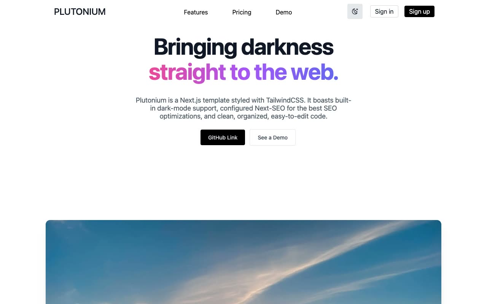

# Plutonium: Next.js Startup Landing Page Template Clone

[](./demo.mp4)

A pixel-faithful reproduction of "Plutonium," a free Next.js 11 and TailwindCSS 2 startup landing-page template by Saurish Srivastava. The static implementation includes its sticky glass navigation, gradient hero, sponsor grid, feature imagery, pricing cards, deliberate demo/404 page, and persisted light and dark themes.

The advertised live demo currently returns Vercel's `DEPLOYMENT_NOT_FOUND` response. The original repository is the available design reference.

## Pages

- `index.html`: home page with hero, sponsors, features, pricing, and footer.
- `404.html`: the intentional demo destination with a return-home action.
- `styles.css`: shared light and dark styling, gradients, glass navigation, and transitions.
- `theme.js`: theme persistence and responsive navigation behavior.

## Run

This project has no build step. Serve the folder over HTTP and open `index.html`:

```sh
python3 -m http.server 8000
# then open http://localhost:8000/index.html
```

You can also open `index.html` directly in a browser, though a local server is recommended so relative links and assets resolve reliably.

The full build spec, including the exact color palette, type scale, and layout for every section, is in `prompt.md`, and `demo.mp4` (with `poster.jpg`) shows the template in motion.

## Credits

Faithful clone of an existing design, recreated for study/learning. All credit for the original design goes to its creators.

**Original:** minor/plutonium (Saurish Srivastava), <https://github.com/minor/plutonium>

---

Part of the [Templates](../../../) collection. [Browse the live gallery](https://pulkitxm.com/).
