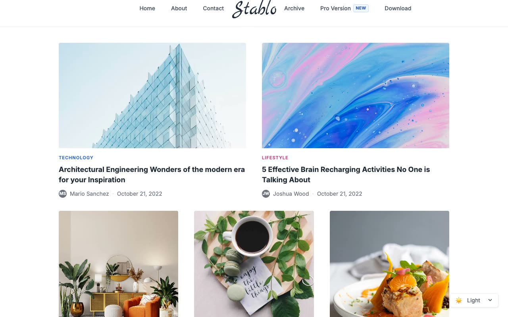

# Stablo Minimal Blog Website

[](./demo.mp4)

A faithful reproduction of the Stablo minimal blog template by Web3Templates, built as a self-contained HTML, CSS, and JavaScript project with no build step. The typography-forward design includes a centered script wordmark, category-colored post labels, responsive post grids, image hover transitions, and five complete page types.

## Features

- Typography-first minimal blog layout with a centered max-width container
- Home page with a 2-column featured post grid and a 3-column secondary post grid (14 posts total)
- Category-colored labels for Technology, Lifestyle, Travel, Design, and Personal Growth
- Hover scale transition on all post card images (scale 1.05, 300ms)
- Responsive navigation with a hamburger-toggled mobile dropdown
- Light / Dark / System theme toggle with no-flash initialization via `localStorage`
- Dual SVG logos (light and dark variants) that swap with the active theme
- Author avatar, name, date, and read time on every post card and post page
- Author bio card at the bottom of each post page

## Pages

| File | Route | Description |
|---|---|---|
| `index.html` | `/` | Home with featured and three-column post grids |
| `about.html` | `/about` | About with a team photo grid and centered copy |
| `contact.html` | `/contact` | Contact information and message form |
| `archive.html` | `/archive` | Three-column archive with pagination |
| `post.html` | `/post/...` | Article with full-width image and author bio |

## Run

No build step required. Open `index.html` directly in a browser, or serve the folder with a static server:

```sh
python3 -m http.server
```

Then visit `http://localhost:8000` in your browser.

## Theme Support

The theme toggle select (bottom-right corner of every page) offers three modes:

- **Light** uses a white background and dark text.
- **Dark** uses a black background and muted light text.
- **System** follows the operating system preference.

The selected theme is persisted to `localStorage` under the key `stablo-theme`. A no-flash inline script at the top of `<head>` applies the saved theme before first paint.

## Assets

All assets live in the `assets/` folder:

- `logo-light.svg` and `logo-dark.svg`: theme-aware wordmarks
- `post1.png` through `post14.png` or `.jpg`: post and featured images
- `team1.jpg` through `team3.jpg`: team photos

The full build spec is in `prompt.md` and the template in motion is shown in `demo.mp4`.

## Credits

Faithful clone of an existing design, recreated for study/learning. All credit for the original design goes to its creators.

**Original:** Web3Templates Stablo: <https://stablo.web3templates.com>
