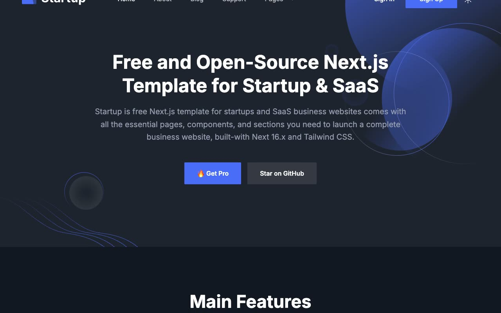

# Startup

[](./demo.mp4)

A self-contained recreation of the Startup business and SaaS template using HTML, CSS, and JavaScript.

## Pages

- `index.html`
- `about.html`
- `blog.html`
- `blog-details.html`
- `blog-sidebar.html`
- `contact.html`
- `signin.html`
- `signup.html`
- `error.html`

## Features

- Responsive navigation and Pages menu
- Persistent light and dark themes
- Sticky header behavior
- Keyboard-operable pricing switch
- Accessible form labels and inline submission feedback
- Local fonts, images, and icons

## Run

Serve the directory with any static file server:

```sh
python3 -m http.server 8000
```

Then open `http://localhost:8000/`.

Reference: [Startup by Next.js Templates](https://startup.demo.nextjstemplates.com)
